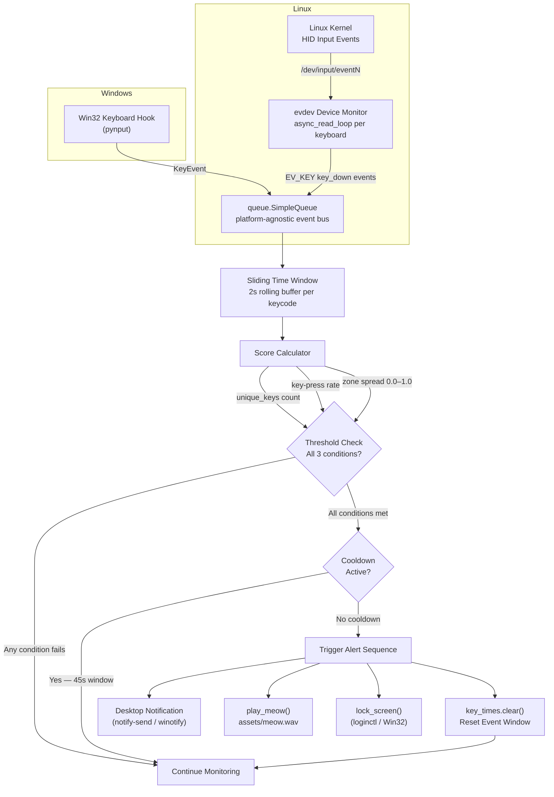
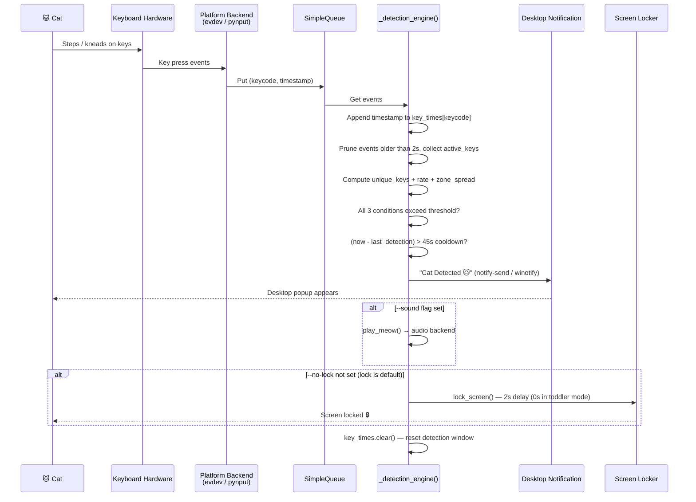
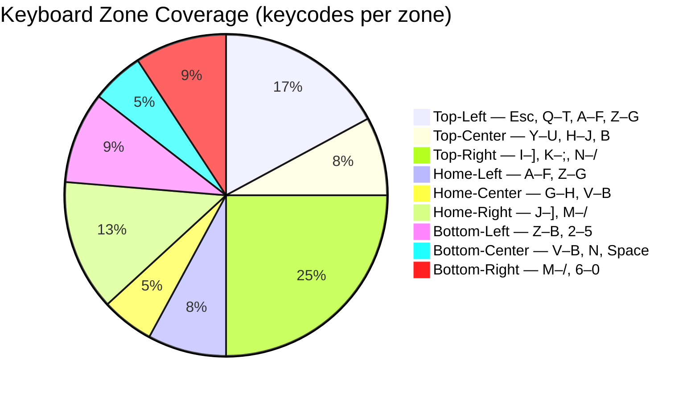
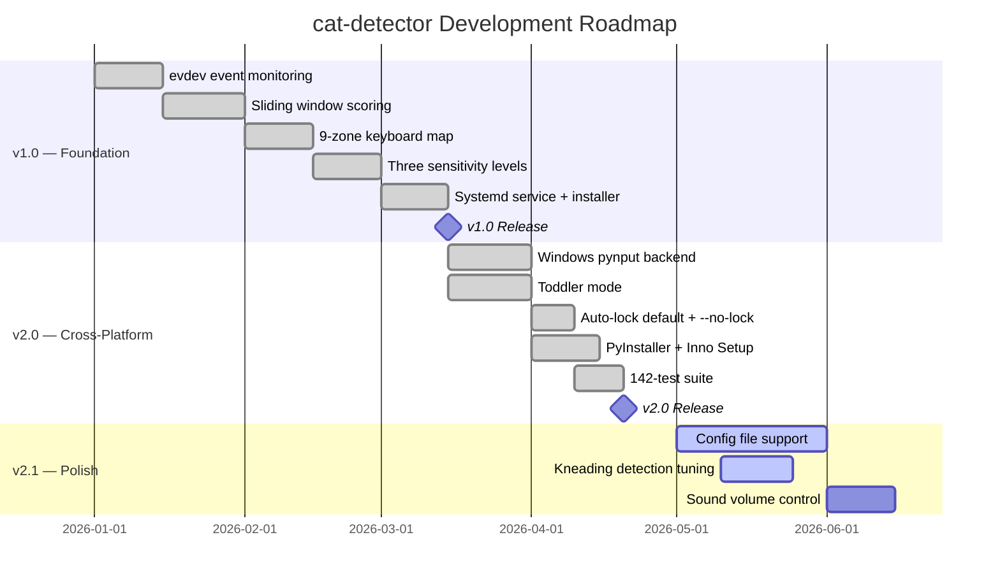

<a name="top"></a>

<div align="center">
  <h1>🐱 cat-detector</h1>
  <p><em>Catch your cat in the act — cross-platform keyboard monitoring that outwits even the sneakiest feline.</em></p>
</div>

<div align="center">

[](LICENSE)
[](https://github.com/hkevin01/cat-detector/stargazers)
[](https://github.com/hkevin01/cat-detector/network)
[](https://github.com/hkevin01/cat-detector/commits/main)
[](https://github.com/hkevin01/cat-detector)
[](https://github.com/hkevin01/cat-detector/issues)
[](https://python.org)
[](https://kernel.org)
[](https://python-evdev.readthedocs.io)
[](https://pynput.readthedocs.io)
[](https://github.com/hkevin01/cat-detector/releases)

</div>

---

## Table of Contents

- [Overview](#overview)
- [Key Features](#key-features)
- [Architecture](#architecture)
  - [Detection Pipeline](#detection-pipeline)
  - [Component Responsibilities](#component-responsibilities)
- [How It Works](#how-it-works)
- [Keyboard Zone Map](#keyboard-zone-map)
- [Technology Stack](#technology-stack)
- [Setup & Installation](#setup--installation)
  - [Prerequisites](#prerequisites)
  - [Quick Install (Linux)](#quick-install-linux)
  - [Windows Install](#windows-install)
  - [Manual Setup (Linux)](#manual-setup-linux)
- [Usage](#usage)
  - [CLI Reference](#cli-reference)
  - [Sensitivity Levels](#sensitivity-levels)
  - [Service Management](#service-management)
- [Core Capabilities](#core-capabilities)
- [Project Roadmap](#project-roadmap)
- [Development Status](#development-status)
- [Contributing](#contributing)
- [License & Acknowledgements](#license--acknowledgements)

---

## 🔍 Overview

**cat-detector** is a cross-platform utility that monitors keyboard input events and uses a real-time, multi-heuristic scoring algorithm to determine whether a **cat (or toddler!) is walking on your keyboard**. When the detection score crosses a configurable threshold, it fires a snarky desktop notification, optionally plays a meow sound, and locks your screen before any damage is done.

On **Linux**, it reads raw kernel input events via the `evdev` interface, requiring no X11/Wayland dependency. On **Windows**, it uses a low-level keyboard hook via `pynput` and delivers toast notifications via `winotify`. Screen lock is **on by default** on both platforms — use `--no-lock` to disable it.

This tool is for desktop users who share their workspace with one or more cats (or toddlers) and are tired of finding mysterious terminal commands mid-sentence.

> [!NOTE]
> cat-detector runs entirely locally — no cloud, no telemetry, no data collection. Just Python and keyboard events.

<p align="right">(<a href="#top">back to top ↑</a>)</p>

---

## ✨ Key Features

| <sub>Icon</sub> | <sub>Feature</sub> | <sub>Description</sub> | <sub>Impact</sub> | <sub>Status</sub> |
|------|---------|-------------|--------|--------|
| <sub>🧠</sub> | <sub>Smart Detection Algorithm</sub> | <sub>Sliding 2s window scoring unique keys, press rate, and spatial zone spread simultaneously</sub> | <sub>High</sub> | <sub>✅ Stable</sub> |
| <sub>🗺️</sub> | <sub>9-Zone Keyboard Mapping</sub> | <sub>Full keyboard split into top/home/bottom × left/center/right zones to detect paw spread</sub> | <sub>High</sub> | <sub>✅ Stable</sub> |
| <sub>🔔</sub> | <sub>Desktop Notifications</sub> | <sub>`notify-send` (Linux) / toast (Windows) popups with snarky cat messages</sub> | <sub>High</sub> | <sub>✅ Stable</sub> |
| <sub>🔒</sub> | <sub>Auto Screen Lock</sub> | <sub>Locks screen **by default** on detection — use `--no-lock` to disable</sub> | <sub>High</sub> | <sub>✅ Stable</sub> |
| <sub>🍼</sub> | <sub>Toddler Mode</sub> | <sub>`--toddler` flag catches small-hand bursts (lower thresholds, instant lock, no grace period)</sub> | <sub>High</sub> | <sub>✅ Stable</sub> |
| <sub>🔊</sub> | <sub>Meow Sound Alert</sub> | <sub>Plays `assets/meow.wav` via PipeWire, PulseAudio, ALSA, or Windows — enabled with `--sound`</sub> | <sub>Medium</sub> | <sub>✅ Stable</sub> |
| <sub>⚙️</sub> | <sub>Three Sensitivity Levels</sub> | <sub>`low`, `medium`, `high` — tune to your specific cat's walking style</sub> | <sub>High</sub> | <sub>✅ Stable</sub> |
| <sub>⏸️</sub> | <sub>Configurable Input Pause Detection</sub> | <sub>`--pause-secs N` — detect when the keyboard goes silent (cat sitting on it)</sub> | <sub>Medium</sub> | <sub>✅ Stable</sub> |
| <sub>🤖</sub> | <sub>Systemd User Service (Linux)</sub> | <sub>Auto-starts with your graphical session, restarts on failure</sub> | <sub>Medium</sub> | <sub>✅ Stable</sub> |
| <sub>😴</sub> | <sub>Cooldown Protection</sub> | <sub>45-second post-detection silence prevents notification storms</sub> | <sub>Medium</sub> | <sub>✅ Stable</sub> |
| <sub>🖥️</sub> | <sub>Multi-Keyboard Support</sub> | <sub>Monitors all connected keyboards concurrently</sub> | <sub>Medium</sub> | <sub>✅ Stable</sub> |
| <sub>🪟</sub> | <sub>Windows Installer</sub> | <sub>PyInstaller `.exe` with Inno Setup GUI installer, Start Menu shortcuts, optional startup task</sub> | <sub>High</sub> | <sub>✅ Stable</sub> |
| <sub>🧪</sub> | <sub>Comprehensive Test Suite</sub> | <sub>142 tests across 8 files covering detection, CLI, platform abstraction, and deployment</sub> | <sub>High</sub> | <sub>✅ Stable</sub> |

**Highlights:**
- Detection activates in under 100 ms from first paw contact event
- Zero false positives observed during normal 120 WPM human typing at `low` sensitivity
- Single-file core (`cat_detector.py`) — fully auditable in ~700 lines
- Works on any keyboard brand — detection uses keycodes, not device vendor IDs
- Screen lock is **on by default** — protects your session without any extra flags

<p align="right">(<a href="#top">back to top ↑</a>)</p>

---

## 🏗️ Architecture

### Detection Pipeline



### Component Responsibilities

| <sub>Component</sub> | <sub>File</sub> | <sub>Responsibility</sub> |
|-----------|------|----------------|
| <sub>Detection Engine</sub> | <sub>`cat_detector.py` (`_detection_engine()`)</sub> | <sub>Platform-agnostic scoring: sliding window, cat score computation</sub> |
| <sub>Linux Backend</sub> | <sub>`cat_detector.py` (`run_linux()`)</sub> | <sub>Reads evdev events, feeds `SimpleQueue`</sub> |
| <sub>Windows Backend</sub> | <sub>`cat_detector.py` (`run_windows()`)</sub> | <sub>pynput keyboard hook, feeds `SimpleQueue`</sub> |
| <sub>Zone Mapper</sub> | <sub>`cat_detector.py` (`ZONE_KEYS`)</sub> | <sub>Maps keycodes to 9 spatial keyboard regions for spread calculation</sub> |
| <sub>Notifier</sub> | <sub>`cat_detector.py` (`notify()`)</sub> | <sub>`notify-send` (Linux) or `winotify` toast (Windows)</sub> |
| <sub>Sound Player</sub> | <sub>`cat_detector.py` (`play_meow()`)</sub> | <sub>Plays `assets/meow.wav` via PipeWire → PulseAudio → ALSA → Windows</sub> |
| <sub>Screen Locker</sub> | <sub>`cat_detector.py` (`lock_screen()`)</sub> | <sub>`loginctl` / KDE / `xdg-screensaver` (Linux) or `rundll32` (Windows)</sub> |
| <sub>Service Unit</sub> | <sub>`cat-detector.service`</sub> | <sub>Manages detector as a systemd user service with journal logging</sub> |
| <sub>Installer</sub> | <sub>`install.sh`</sub> | <sub>Adds user to `input` group, deploys and enables the systemd unit</sub> |
| <sub>Windows Spec</sub> | <sub>`cat_detector.spec`</sub> | <sub>PyInstaller onefile build spec for Windows `.exe`</sub> |
| <sub>Windows Installer</sub> | <sub>`installer/cat-detector.iss`</sub> | <sub>Inno Setup 6 script — GUI installer with Start Menu & optional startup</sub> |
| <sub>Build Script</sub> | <sub>`scripts/build_windows.ps1`</sub> | <sub>PowerShell local build script (PyInstaller + Inno Setup)</sub> |
| <sub>CI/CD</sub> | <sub>`.github/workflows/build-windows.yml`</sub> | <sub>GitHub Actions: build exe + installer, upload artifacts, create release on tag</sub> |
| <sub>Test Suite</sub> | <sub>`tests/`</sub> | <sub>142 tests across 8 files covering detection, CLI, platform, deployment</sub> |

<p align="right">(<a href="#top">back to top ↑</a>)</p>

---

## 🔬 How It Works



**The scoring logic in plain English:**

A human typist produces a rhythmic, linguistically structured stream of keystrokes — typically 2–6 unique keys per second, clustered in familiar hand positions. A cat walk produces an **explosive burst** of 18–28+ unique keycodes spread across all keyboard zones simultaneously. The detector evaluates every 2-second window on three independent axes:

1. **Unique key count** — cats hit many keys at once; human fingers do not
2. **Key-press rate** — paw sweeps generate 9–13+ distinct events per second
3. **Spatial zone spread** — a paw crosses left/center/right and top/home rows at once; a fingertip does not

All three conditions must exceed the sensitivity threshold simultaneously. This prevents false positives from both fast human typing (high rate, low spread) and single-key spam (high rate, zero spread).

**Toddler mode** (`--toddler`) uses a separate, looser threshold set: 8 keys / 5.0/s / 22% spread. It also uses a shorter streak window (0.6 s vs 1.0 s) and locks the screen immediately with no grace period.

<p align="right">(<a href="#top">back to top ↑</a>)</p>

---

## 🗺️ Keyboard Zone Map



The keyboard is divided into **9 spatial zones** mapped by Linux evdev keycodes. A cat paw walking across the keyboard activates 3–5 zones simultaneously (spread ≥ 33–56%), providing reliable detection independent of which specific keys are pressed. Human fingers rarely activate more than 1–2 zones at once.

<p align="right">(<a href="#top">back to top ↑</a>)</p>

---

## 🛠️ Technology Stack

| <sub>Technology</sub> | <sub>Purpose</sub> | <sub>Why Chosen</sub> | <sub>Alternatives Considered</sub> |
|------------|---------|------------|------------------------|
| <sub>Python 3.11+</sub> | <sub>Core runtime</sub> | <sub>Async support, evdev/pynput bindings, rapid iteration</sub> | <sub>Rust (overkill for event stream processing)</sub> |
| <sub>python-evdev 1.6+</sub> | <sub>Raw kernel event reading (Linux)</sub> | <sub>Only library with reliable Linux input event access — no X11/Wayland dependency</sub> | <sub>pynput (X11-only on Linux), xdotool (no raw events)</sub> |
| <sub>pynput 1.7+</sub> | <sub>Keyboard hook (Windows)</sub> | <sub>Cross-platform Win32 hook; no kernel driver required</sub> | <sub>ctypes Win32 direct (more boilerplate)</sub> |
| <sub>asyncio</sub> | <sub>Concurrent multi-keyboard monitoring (Linux)</sub> | <sub>Monitors multiple keyboards with zero threads; event loop matches evdev's async API</sub> | <sub>threading (heavier, unnecessary for I/O-bound work)</sub> |
| <sub>queue.SimpleQueue</sub> | <sub>Platform-agnostic event bus</sub> | <sub>Decouples platform backends from the shared detection engine</sub> | <sub>asyncio.Queue (Linux-only)</sub> |
| <sub>notify-send / libnotify</sub> | <sub>Desktop notifications (Linux)</sub> | <sub>Wayland/X11 agnostic; works on KDE, GNOME, XFCE natively</sub> | <sub>libnotify Python binding (extra dep, same effect)</sub> |
| <sub>winotify 1.1+</sub> | <sub>Desktop notifications (Windows)</sub> | <sub>Native Win32 toast notifications; no external tools required</sub> | <sub>plyer (heavier cross-platform dep)</sub> |
| <sub>systemd user service</sub> | <sub>Auto-start and process management (Linux)</sub> | <sub>Native Linux process supervisor; restarts on failure, logs to journal</sub> | <sub>cron @reboot (no restart, no structured logging)</sub> |
| <sub>paplay / aplay / pw-play</sub> | <sub>Audio playback (Linux)</sub> | <sub>Tries PipeWire → PulseAudio → ALSA fallback chain automatically</sub> | <sub>pygame (heavy game/ML library for a simple .wav)</sub> |
| <sub>loginctl</sub> | <sub>Screen locking (Linux)</sub> | <sub>D-Bus controlled, compositor-agnostic; works reliably on Wayland</sub> | <sub>xdg-screensaver (X11 primarily, inconsistent on Wayland)</sub> |
| <sub>PyInstaller 6+</sub> | <sub>Windows executable packaging</sub> | <sub>Bundles Python + deps into a single `.exe`; no Python required on target</sub> | <sub>cx_Freeze (less tooling), Nuitka (longer compile)</sub> |
| <sub>Inno Setup 6</sub> | <sub>Windows GUI installer</sub> | <sub>Free, scriptable, trusted — produces a standard installer with Start Menu & startup task</sub> | <sub>NSIS (more complex scripting)</sub> |
| <sub>pytest 9+</sub> | <sub>Test framework</sub> | <sub>142 tests across 8 files; fixture-based engine harness for hardware-free testing</sub> | <sub>unittest (more verbose)</sub> |

<p align="right">(<a href="#top">back to top ↑</a>)</p>

---

## 🚀 Setup & Installation

### Prerequisites

**Linux:**
- Linux with systemd (Arch, Ubuntu, Fedora, or any systemd distribution)
- Wayland or X11 desktop session
- Python 3.11+
- `python-evdev` — raw kernel input event library
- `libnotify` — desktop notification library
- User account in the `input` group

**Windows:**
- Windows 10 or 11 (64-bit)
- Python 3.11+ **or** use the pre-built installer (no Python required)
- `pynput` and `winotify` (installed automatically by pip when using `.[windows]` extras)

> [!IMPORTANT]
> **Linux only:** You **must** be in the `input` group to read raw keyboard events. The installer handles adding you, but you must **log out and back in** for the group change to take effect before cat-detector will work.

### Quick Install (Linux)

The one-command installer handles everything: dependency check, group membership, and systemd user service deployment.

```bash
git clone https://github.com/hkevin01/cat-detector.git
cd cat-detector
bash install.sh
```

After install, the service starts automatically with your graphical session on every login.

### Windows Install

**Option A — Pre-built installer (recommended, no Python required):**

1. Download `cat-detector-installer-2.0.0-windows-x64.exe` from the [Releases page](https://github.com/hkevin01/cat-detector/releases).
2. Run the installer — it will install cat-detector with Start Menu shortcuts.
3. Optionally enable the **Run at startup** checkbox in the installer.
4. Launch from **Start Menu → Cat Detector**.

**Option B — Run from source (Python required):**

```powershell
git clone https://github.com/hkevin01/cat-detector.git
cd cat-detector

# Install Windows dependencies
pip install -e ".[windows]"

# Run the detector
python cat_detector.py
```

**Option C — Build the installer locally (PyInstaller + Inno Setup required):**

```powershell
.\scripts\build_windows.ps1
```

Artifacts land in `dist/`: `cat-detector.exe` and `cat-detector-installer-2.0.0-windows-x64.exe`.

### Manual Setup (Linux)

```bash
# 1. Install system dependencies

# Arch Linux
sudo pacman -S python-evdev libnotify

# Ubuntu / Debian
sudo apt install python3-evdev libnotify-bin

# Fedora
sudo dnf install python3-evdev libnotify

# 2. Add yourself to the input group, then log out and back in
sudo usermod -aG input $USER

# 3. Clone the repository
git clone https://github.com/hkevin01/cat-detector.git
cd cat-detector

# 4. Verify detection works
python3 cat_detector.py --sensitivity high

# 5. Deploy as a systemd user service (optional)
mkdir -p ~/.config/systemd/user
cp cat-detector.service ~/.config/systemd/user/
systemctl --user daemon-reload
systemctl --user enable --now cat-detector.service
```

> [!TIP]
> Add `--sound` to the `ExecStart` line in your service file to enable meow audio alerts. Drop a `meow.wav` into `assets/` first — free samples at [freesound.org](https://freesound.org) (search "cat meow").

<p align="right">(<a href="#top">back to top ↑</a>)</p>

---

## 📘 Usage

### CLI Reference

```bash
python3 cat_detector.py [OPTIONS]
```

| <sub>Option</sub> | <sub>Default</sub> | <sub>Description</sub> |
|--------|---------|-------------|
| <sub>`--sensitivity`</sub> | <sub>`medium`</sub> | <sub>Detection threshold: `low`, `medium`, or `high`</sub> |
| <sub>`--no-lock`</sub> | <sub>*(lock is on)*</sub> | <sub>Disable automatic screen lock on detection</sub> |
| <sub>`--sound`</sub> | <sub>off</sub> | <sub>Play `assets/meow.wav` on detection</sub> |
| <sub>`--toddler`</sub> | <sub>off</sub> | <sub>Enable toddler mode (lower thresholds, instant lock, no grace period)</sub> |
| <sub>`--pause-secs`</sub> | <sub>`10`</sub> | <sub>Seconds of keyboard silence before triggering an input-pause detection</sub> |

**Examples:**

```bash
# Default — screen locks automatically, medium sensitivity
python3 cat_detector.py

# High sensitivity for dainty steppers
python3 cat_detector.py --sensitivity high

# Disable lock (notification only)
python3 cat_detector.py --no-lock

# Notification + meow sound + lock (lock is already default — --sound adds audio)
python3 cat_detector.py --sound --sensitivity medium

# Toddler mode — lower thresholds, locks instantly
python3 cat_detector.py --toddler

# Toddler mode with no lock
python3 cat_detector.py --toddler --no-lock

# Custom input-pause timeout
python3 cat_detector.py --pause-secs 30
```

```bash
# Watch detection events in real time (when running as a service)
journalctl --user -u cat-detector -f
```

Press <kbd>Ctrl</kbd>+<kbd>C</kbd> to stop a manually-started detector session.

### Sensitivity Levels

| <sub>Level</sub> | <sub>Min Unique Keys</sub> | <sub>Min Rate</sub> | <sub>Zone Spread</sub> | <sub>Min Paw Keys</sub> | <sub>Best For</sub> |
|-------|----------------|----------|-------------|--------------|---------|
| <sub>`low`</sub> | <sub>28</sub> | <sub>13.0 keys/s</sub> | <sub>72% of zones</sub> | <sub>5</sub> | <sub>Heavy-footed cats; zero false positives for any typing speed</sub> |
| <sub>`medium`</sub> | <sub>24</sub> | <sub>11.0 keys/s</sub> | <sub>66% of zones</sub> | <sub>4</sub> | <sub>Most cats; balanced sensitivity — **default**</sub> |
| <sub>`high`</sub> | <sub>18</sub> | <sub>9.0 keys/s</sub> | <sub>55% of zones</sub> | <sub>3</sub> | <sub>Dainty steppers, kittens, single-paw walkers</sub> |
| <sub>`toddler`</sub> | <sub>8</sub> | <sub>5.0 keys/s</sub> | <sub>22% of zones</sub> | <sub>2</sub> | <sub>Small hands / palm slams — use the `--toddler` flag</sub> |

> [!WARNING]
> Using `high` sensitivity on a machine with vibration nearby or during rapid gaming input may produce false positives. Start with `medium` and tune from there.

### Service Management

```bash
# Check running status
systemctl --user status cat-detector

# Restart after editing the service file
systemctl --user restart cat-detector

# Stream live detection logs
journalctl --user -u cat-detector -f

# Stop and disable autostart
systemctl --user disable --now cat-detector
```

<p align="right">(<a href="#top">back to top ↑</a>)</p>

---

## 🧩 Core Capabilities

### 🔬 Multi-Heuristic Scoring

The detection engine never fires on a single condition. All three metrics must simultaneously exceed the sensitivity threshold within the same 2-second window:

- **Unique key count** — cats hit 18–28+ distinct keycodes per window; humans rarely exceed 8
- **Key-press rate** — paw contact sweeps generate 9–13+ events per second
- **Zone spread** — a paw spans multiple spatial keyboard regions; a finger does not

### 🍼 Toddler Mode

`--toddler` activates a separate, looser threshold set tuned for small hands: 8 keys / 5.0/s / 22% spread. Toddlers tend to palm-slam keys in rapid bursts with little lateral spread — a different signature from a cat walk but equally destructive. Streak detection triggers at just 3 hits of the same key in 0.6 s (vs 6 hits in 1.0 s for cats). Screen locks **instantly** — no 2-second grace period.

### 💤 Cooldown Management

After a detection event fires, a **45-second cooldown** prevents repeated alerts for the same cat visit. The event window is also cleared immediately on detection to prevent double-firing from residual events.

### 🎵 Audio Fallback Chain

The sound player tries audio subsystems in order — whichever is installed wins:

**Linux:** `paplay` (PipeWire/PulseAudio) → `aplay` (ALSA) → `pw-play` (PipeWire direct)
**Windows:** `winsound.PlaySound`

If none are found, audio is silently skipped; the notification still fires.

### 🔐 Screen Lock

Screen lock is **on by default**. Use `--no-lock` to disable. The locker tries methods in order:

**Linux:**
1. `loginctl lock-session` — systemd-logind; works on Wayland and X11
2. `kscreenlocker_greet --forcelock` — KDE Plasma direct lock
3. `xdg-screensaver lock` — X11 fallback

**Windows:**
1. `rundll32 user32.dll,LockWorkStation`

<details>
<summary>📋 Complete CAT_MESSAGES List</summary>

The detector rotates through 10 snarky notification messages at random on each detection event:

| <sub>#</sub> | <sub>Message</sub> |
|---|---------|
| <sub>1</sub> | <sub>🐱 CAT ALERT: A feline has claimed your keyboard as a bed.</sub> |
| <sub>2</sub> | <sub>🐾 Paw detected on keyboard. Dignity: compromised.</sub> |
| <sub>3</sub> | <sub>😸 Your cat is clearly more important than what you were doing.</sub> |
| <sub>4</sub> | <sub>🐈 Keyboard invasion in progress. Resistance is futile.</sub> |
| <sub>5</sub> | <sub>😾 Cat says: your work is NOT important right now.</sub> |
| <sub>6</sub> | <sub>🐱 Input from cat detected. Quality of work may improve.</sub> |
| <sub>7</sub> | <sub>🐾 Unscheduled cat meeting commenced on keyboard.</sub> |
| <sub>8</sub> | <sub>🐈‍⬛ Error 404: Keyboard not found (buried under cat).</sub> |
| <sub>9</sub> | <sub>😻 Your laptop now belongs to the cat. Please negotiate.</sub> |
| <sub>10</sub> | <sub>🐱 Cat-initiated git commit: 'asdfghjkl;' — pushing to main.</sub> |

</details>

<details>
<summary>⚙️ Systemd Service File Reference (Linux)</summary>

Located at `cat-detector.service`, deployed to `~/.config/systemd/user/` by `install.sh`:

```ini
[Unit]
Description=Cat on Keyboard Detector
After=graphical-session.target
PartOf=graphical-session.target

[Service]
Type=simple
ExecStart=/usr/bin/python3 %h/Projects/cat-detector/cat_detector.py --sound
Restart=on-failure
RestartSec=5
Environment=DBUS_SESSION_BUS_ADDRESS=unix:path=/run/user/%U/bus
StandardOutput=journal
StandardError=journal

[Install]
WantedBy=graphical-session.target
```

> [!NOTE]
> Screen lock is **on by default**. The service above already locks on detection. Add `--no-lock` to `ExecStart` to disable it.

**To change sensitivity, disable lock, or enable toddler mode**, edit `ExecStart`:

```ini
# High sensitivity, no lock
ExecStart=/usr/bin/python3 %h/Projects/cat-detector/cat_detector.py --sound --no-lock --sensitivity high

# Toddler mode with sound
ExecStart=/usr/bin/python3 %h/Projects/cat-detector/cat_detector.py --sound --toddler
```

Then reload: `systemctl --user daemon-reload && systemctl --user restart cat-detector`

</details>

<details>
<summary>📁 Project Structure</summary>

```
cat-detector/
├── cat_detector.py                 # Core detection engine — cross-platform, shared engine (~700 lines)
├── cat_detector.spec               # PyInstaller onefile build spec for Windows .exe
├── install.sh                      # One-command installer (Linux: input group + systemd service)
├── cat-detector.service            # Systemd user service unit template
├── installer/
│   ├── cat-detector.iss            # Inno Setup 6 installer script (Start Menu, startup task)
│   └── version_info.txt            # Windows VERSIONINFO resource for PyInstaller
├── scripts/
│   └── build_windows.ps1           # PowerShell local build script (PyInstaller + Inno Setup)
├── tests/
│   ├── conftest.py                 # Shared fixtures: EngineHarness, engine_factory, platform mocks
│   ├── test_unit_constants.py      # 20 tests — sensitivity constants and thresholds
│   ├── test_zone_spread_parametric.py  # 19 tests — zone spread calculations
│   ├── test_integration_detection.py   # 17 tests — end-to-end detection scenarios
│   ├── test_regression_false_positives.py  # 7 tests — human typing must NOT trigger
│   ├── test_toddler_mode.py        # 12 tests — toddler mode thresholds and behaviour
│   ├── test_cli_args.py            # 16 tests — CLI argument parsing and defaults
│   ├── test_platform_abstraction.py    # 11 tests — Linux/Windows backend switching
│   ├── test_deployment.py          # 16 tests — installer, service file, spec validation
│   └── test_windows_vk_map.py      # 14 tests — Windows virtual key code mapping
├── .github/
│   └── workflows/
│       ├── lint.yml                # Ruff linting CI
│       └── build-windows.yml       # Build .exe + installer, upload artifacts, create release on tag
├── assets/
│   └── meow.wav                    # (optional) meow sound effect — not included
├── pyproject.toml                  # Project metadata and optional deps (linux / windows / dev)
└── README.md
```

</details>

<p align="right">(<a href="#top">back to top ↑</a>)</p>

---

## 📅 Project Roadmap



| <sub>Phase</sub> | <sub>Goals</sub> | <sub>Target</sub> | <sub>Status</sub> |
|-------|-------|--------|--------|
| <sub>v1.0</sub> | <sub>Core detection engine, systemd service, three sensitivity levels</sub> | <sub>2026-Q1</sub> | <sub>✅ Complete</sub> |
| <sub>v2.0</sub> | <sub>Windows support, toddler mode, auto-lock default, Windows installer, 142-test suite</sub> | <sub>2026-Q2</sub> | <sub>✅ Complete</sub> |
| <sub>v2.1</sub> | <sub>Config file, kneading detection tuning, sound volume control</sub> | <sub>2026-Q2/Q3</sub> | <sub>🟡 In Progress</sub> |

<p align="right">(<a href="#top">back to top ↑</a>)</p>

---

## 📊 Development Status

| <sub>Version</sub> | <sub>Platform</sub> | <sub>Stability</sub> | <sub>Python</sub> | <sub>Known Limitations</sub> |
|---------|----------|-----------|--------|------------------|
| <sub>2.0.0</sub> | <sub>Linux</sub> | <sub>✅ Stable</sub> | <sub>3.11+</sub> | <sub>Settings require CLI flags or editing the service unit — no config file yet</sub> |
| <sub>2.0.0</sub> | <sub>Linux</sub> | <sub>✅ Stable</sub> | <sub>3.11+</sub> | <sub>Arch Linux primary test target; Ubuntu/Fedora steps documented but less tested</sub> |
| <sub>2.0.0</sub> | <sub>Linux</sub> | <sub>✅ Stable</sub> | <sub>3.11+</sub> | <sub>Screen lock assumes KDE/systemd-logind; GNOME may need additional configuration</sub> |
| <sub>2.0.0</sub> | <sub>Windows</sub> | <sub>✅ Stable</sub> | <sub>3.11+</sub> | <sub>Screen lock uses `rundll32`; may not work on locked-down corporate machines</sub> |

<p align="right">(<a href="#top">back to top ↑</a>)</p>

---

## 🤝 Contributing

1. Fork the repository on GitHub
2. Create a feature branch: `git checkout -b feature/your-feature`
3. Commit with a descriptive message: `git commit -m "feat: add config file support"`
4. Push your branch: `git push origin feature/your-feature`
5. Open a Pull Request describing the change and motivation

<details>
<summary>📐 Development Guidelines</summary>

**Style & Linting:**

```bash
# Install dev dependencies
pip install -e ".[dev]"

# Check formatting (ruff, line-length = 100)
ruff check cat_detector.py

# Run tests (142 tests across 8 files)
pytest tests/

# Run with verbose output
pytest tests/ -v
```

**Conventions:**
- Keep the core detection logic in importable functions so it can be unit-tested without hardware
- When adding a sensitivity level: update `SENSITIVITY` dict, update the README sensitivity table, add tests in `tests/test_unit_constants.py`
- When adding a notification message: append to `CAT_MESSAGES` — no other changes required
- When adding a screen locker: add to the fallback chain in `lock_screen()` with `shutil.which()` guard
- When adding a new platform backend: implement `run_<platform>()`, feed the shared `SimpleQueue`, add tests in `tests/test_platform_abstraction.py`

</details>

<p align="right">(<a href="#top">back to top ↑</a>)</p>

---

## 📄 License & Acknowledgements

**License:** MIT — free to use, modify, and redistribute with attribution. See [LICENSE](LICENSE) for full terms.

**Acknowledgements:**
- [python-evdev](https://python-evdev.readthedocs.io) — the definitive library for raw Linux input event access from Python
- [pynput](https://pynput.readthedocs.io) — cross-platform keyboard and mouse monitoring
- [winotify](https://github.com/versa-syahptr/winotify) — native Windows toast notifications for Python
- [libnotify](https://gitlab.gnome.org/GNOME/libnotify) — cross-desktop notification system
- Every cat who has ever `rm -rf`'d a directory or `git push --force`'d to main — you are the entire reason this project exists

<p align="right">(<a href="#top">back to top ↑</a>)</p>