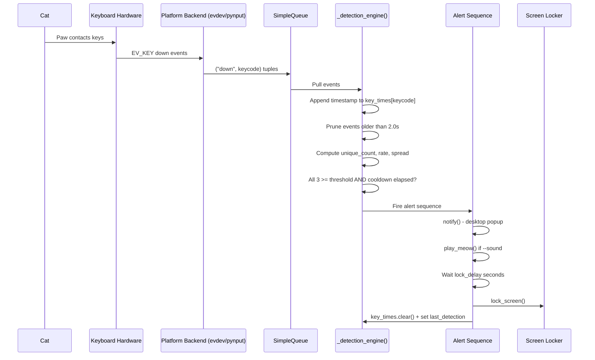
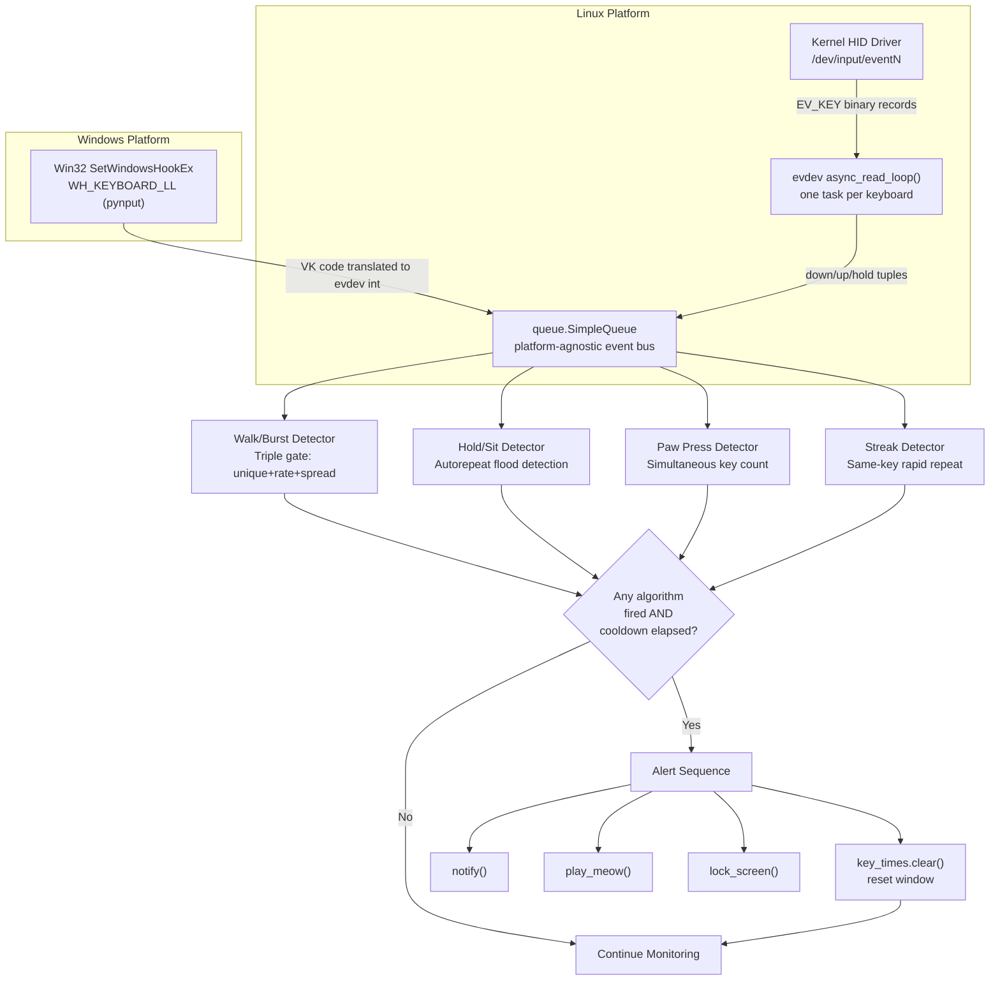
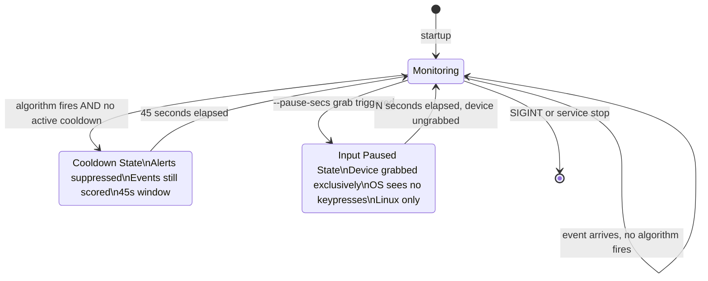
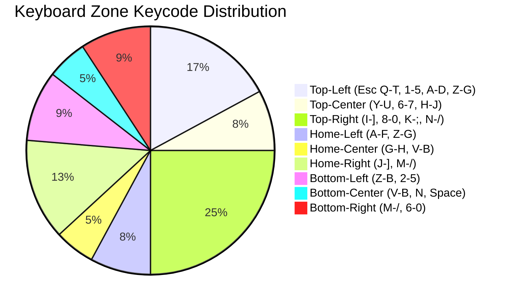
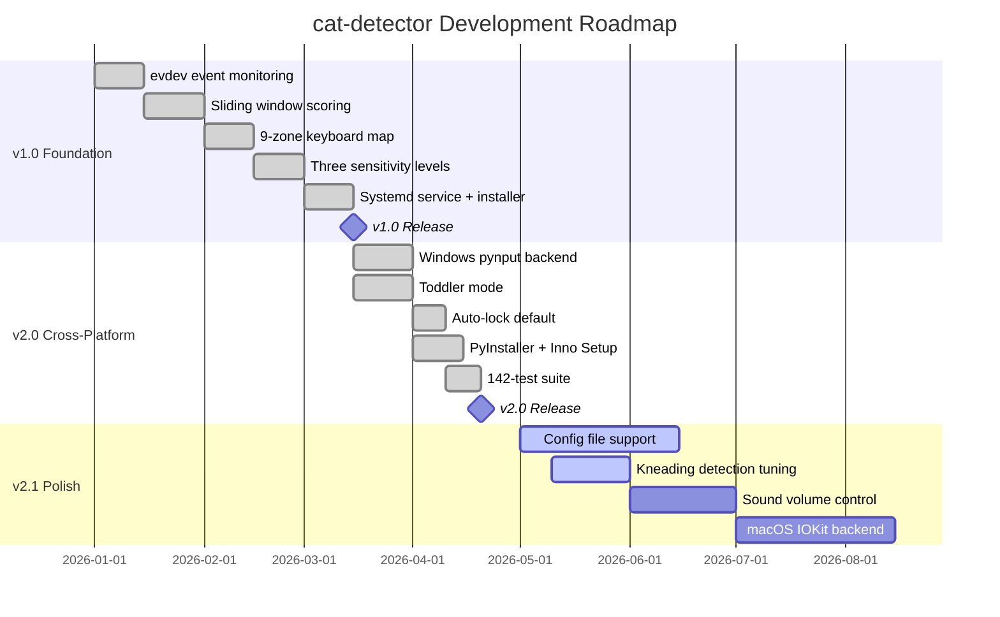

<a name="top"></a>

<div align="center">
  <h1>🐱 cat-detector</h1>
  <p><em>Catch your cat (or toddler) in the act — cross-platform keyboard event monitoring that distinguishes feline paw-walks from human typing using real-time multi-heuristic scoring.</em></p>
</div>

<div align="center">

[](LICENSE)
[](https://github.com/hkevin01/cat-detector/stargazers)
[](https://github.com/hkevin01/cat-detector/network)
[](https://github.com/hkevin01/cat-detector/commits/main)
[](https://github.com/hkevin01/cat-detector)
[](https://github.com/hkevin01/cat-detector/issues)
[](https://python.org)
[](https://kernel.org)
[](https://python-evdev.readthedocs.io)
[](https://pynput.readthedocs.io)
[](https://github.com/hkevin01/cat-detector/releases)
[](tests/)
[](https://github.com/astral-sh/ruff)
[](https://github.com/hkevin01/cat-detector/commits/main)
[](https://github.com/hkevin01/cat-detector/pulls)
[](cat-detector.service)
[](https://wayland.freedesktop.org)

</div>

---

## Table of Contents

- [Overview](#-overview)
- [Quick Decision Guide](#-quick-decision-guide)
- [Detection Mode Comparison](#-detection-mode-comparison)
- [How It Works - Step by Step](#-how-it-works---step-by-step)
  - [Step 1 - Event Capture](#step-1---event-capture)
  - [Step 2 - Sliding Window](#step-2---sliding-window)
  - [Step 3 - Triple Gate Scoring](#step-3---triple-gate-scoring)
  - [Step 4 - Alert Sequence](#step-4---alert-sequence)
- [Detection Algorithms Deep Dive](#-detection-algorithms-deep-dive)
- [Key Features](#-key-features)
- [Architecture](#-architecture)
  - [Detection Pipeline](#detection-pipeline)
  - [Detector State Machine](#detector-state-machine)
  - [Component Responsibilities](#component-responsibilities)
- [Keyboard Zone Map](#-keyboard-zone-map)
- [Technology Stack](#-technology-stack)
- [Platform Differences](#-platform-differences)
- [Setup & Installation](#-setup--installation)
  - [Prerequisites](#prerequisites)
  - [Quick Install (Linux)](#quick-install-linux)
  - [Windows Install](#windows-install)
  - [Manual Setup (Linux)](#manual-setup-linux)
- [Continuous Background Service](#-continuous-background-service)
- [Usage](#-usage)
  - [CLI Reference](#cli-reference)
  - [Sensitivity Levels](#sensitivity-levels)
  - [Service Management](#service-management)
- [API Reference](#-api-reference)
- [Performance and Accuracy](#-performance-and-accuracy)
- [Research and Citations](#-research-and-citations)
- [Project Roadmap](#-project-roadmap)
- [Development Status](#-development-status)
- [Contributing](#-contributing)
- [License and Acknowledgements](#-license-and-acknowledgements)

---

## Overview

**cat-detector** is a cross-platform keyboard monitoring utility that uses a real-time, multi-heuristic scoring engine to determine whether a **cat or toddler** is walking on your keyboard. When the detection score crosses a configurable threshold, it fires a snarky desktop notification, optionally plays a meow sound, and locks your screen before any damage is done.

The fundamental insight behind this tool is that human typing and cat walking produce **structurally different keyboard event streams** that can be reliably separated by three simultaneously-evaluated metrics: the count of unique keys active in a 2-second window, the rate of new key events per second, and the spatial spread of those keys across a 9-zone keyboard map. All three must exceed threshold at the same time - this triple-gate design makes false positive rates negligible even at high sensitivity, because no realistic human typing pattern can simultaneously produce high unique-key counts, high event rate, AND wide spatial spread across unrelated keyboard regions.

On **Linux**, it reads raw kernel input events via the `evdev` interface at `/dev/input/eventN`, which requires no X11 or Wayland dependency - it operates below the display server layer entirely. On **Windows**, it uses a low-level Win32 keyboard hook via `pynput`. Screen lock is **on by default** on both platforms. The detector runs as a lightweight systemd user service on Linux, starting automatically with your graphical session and restarting on failure with exponential backoff.

> [!NOTE]
> cat-detector runs entirely locally - no cloud, no telemetry, no data collection of any kind. All event processing happens inside your Python process. Nothing leaves your machine.

> [!TIP]
> If you have both a cat and a young child, you can run two detection strategies back to back or switch modes via the service `ExecStart` line. Standard mode catches cat-size walks; `--toddler` mode catches palm-slaps from small hands with very low thresholds.

<p align="right">(<a href="#top">back to top</a>)</p>

---

## Quick Decision Guide

Before diving into configuration, use this table to decide immediately which mode and sensitivity to use. The wrong choice can cause false positives (too sensitive) or missed detections (not sensitive enough).

| <sub>#</sub> | <sub>Your Situation</sub> | <sub>Recommended Mode</sub> | <sub>Command</sub> | <sub>Why</sub> |
|---|---|---|---|---|
| <sub>1</sub> | <sub>Normal adult cat, you type at normal speed</sub> | <sub>Cat medium (default)</sub> | <sub>`python3 cat_detector.py`</sub> | <sub>Balanced - catches most cat walks, zero false positives for typical typing</sub> |
| <sub>2</sub> | <sub>Large heavy cat, you type very fast (100+ WPM)</sub> | <sub>Cat low</sub> | <sub>`--sensitivity low`</sub> | <sub>Highest false-positive safety margin; only fires on very large paw bursts</sub> |
| <sub>3</sub> | <sub>Kitten or dainty one-paw stepper</sub> | <sub>Cat high</sub> | <sub>`--sensitivity high`</sub> | <sub>Lower thresholds catch lighter-footed cats that don't cover many zones</sub> |
| <sub>4</sub> | <sub>Young child (1-4 years) near laptop</sub> | <sub>Toddler mode</sub> | <sub>`--toddler`</sub> | <sub>Palm-slap signature is much smaller; needs separate lower thresholds entirely</sub> |
| <sub>5</sub> | <sub>Both cat and toddler present</sub> | <sub>Toddler mode</sub> | <sub>`--toddler`</sub> | <sub>Toddler thresholds are a superset - catches both toddler AND cat events</sub> |
| <sub>6</sub> | <sub>Just want a notification, no screen lock</sub> | <sub>Any mode + no-lock</sub> | <sub>`--no-lock`</sub> | <sub>Suppresses lock but notification and optional sound still fire</sub> |
| <sub>7</sub> | <sub>Gaming rig with WASD spam</sub> | <sub>Cat low</sub> | <sub>`--sensitivity low`</sub> | <sub>Gaming produces high rate but low spread; low sensitivity avoids edge cases</sub> |
| <sub>8</sub> | <sub>Running as always-on background service</sub> | <sub>Cat medium + systemd</sub> | <sub>See service section</sub> | <sub>Default settings are calibrated for 24/7 unattended operation</sub> |

> [!IMPORTANT]
> Do NOT use `--toddler` as your everyday mode if no child is present. Toddler thresholds are so low (8 keys, 5.0/s, 22% spread) that fast human typing will trigger them. It is specifically designed for palm-slam detection.

<p align="right">(<a href="#top">back to top</a>)</p>

---

## Detection Mode Comparison

Understanding the differences between each mode is critical for correct configuration. This section presents side-by-side comparisons of what each mode detects, what it ignores, and when it fires.

### What Each Mode Detects vs. Ignores

| <sub>#</sub> | <sub>Input Type</sub> | <sub>Cat Low</sub> | <sub>Cat Medium</sub> | <sub>Cat High</sub> | <sub>Toddler</sub> |
|---|---|---|---|---|---|
| <sub>1</sub> | <sub>Large cat walking (4+ kg, full stride)</sub> | <sub>Detected</sub> | <sub>Detected</sub> | <sub>Detected</sub> | <sub>Detected</sub> |
| <sub>2</sub> | <sub>Small cat / kitten walking</sub> | <sub>May miss</sub> | <sub>Usually detected</sub> | <sub>Detected</sub> | <sub>Detected</sub> |
| <sub>3</sub> | <sub>Cat kneading one key (streak)</sub> | <sub>Detected</sub> | <sub>Detected</sub> | <sub>Detected</sub> | <sub>Detected</sub> |
| <sub>4</sub> | <sub>Cat sitting / holding keys down (hold)</sub> | <sub>Detected</sub> | <sub>Detected</sub> | <sub>Detected</sub> | <sub>Detected</sub> |
| <sub>5</sub> | <sub>Cat single paw planted (paw press)</sub> | <sub>Detected</sub> | <sub>Detected</sub> | <sub>Detected</sub> | <sub>Detected</sub> |
| <sub>6</sub> | <sub>Toddler palm slam</sub> | <sub>Not detected</sub> | <sub>Not detected</sub> | <sub>Rarely</sub> | <sub>Detected</sub> |
| <sub>7</sub> | <sub>Human typing 60-120 WPM</sub> | <sub>Not detected</sub> | <sub>Not detected</sub> | <sub>Not detected</sub> | <sub>May false-positive</sub> |
| <sub>8</sub> | <sub>Gaming WASD rapid input</sub> | <sub>Not detected</sub> | <sub>Not detected</sub> | <sub>Rare edge case</sub> | <sub>False positive</sub> |
| <sub>9</sub> | <sub>Stuck key / keyboard hardware fault</sub> | <sub>Not detected</sub> | <sub>Not detected</sub> | <sub>Not detected</sub> | <sub>Not detected</sub> |
| <sub>10</sub> | <sub>Single-key spam (same key held)</sub> | <sub>Not detected</sub> | <sub>Not detected</sub> | <sub>Not detected</sub> | <sub>Not detected</sub> |

### Threshold Numbers Side by Side

| <sub>#</sub> | <sub>Parameter</sub> | <sub>Cat Low</sub> | <sub>Cat Medium</sub> | <sub>Cat High</sub> | <sub>Toddler</sub> | <sub>What It Measures</sub> |
|---|---|---|---|---|---|---|
| <sub>1</sub> | <sub>Min unique keys (2s window)</sub> | <sub>28</sub> | <sub>24</sub> | <sub>18</sub> | <sub>8</sub> | <sub>Distinct keycodes active in the last 2 seconds</sub> |
| <sub>2</sub> | <sub>Min key-press rate</sub> | <sub>13.0/s</sub> | <sub>11.0/s</sub> | <sub>9.0/s</sub> | <sub>5.0/s</sub> | <sub>unique_count / WINDOW_SECS</sub> |
| <sub>3</sub> | <sub>Min zone spread</sub> | <sub>72%</sub> | <sub>66%</sub> | <sub>55%</sub> | <sub>22%</sub> | <sub>Fraction of 9 keyboard zones touched</sub> |
| <sub>4</sub> | <sub>Min simultaneous paw keys</sub> | <sub>5</sub> | <sub>4</sub> | <sub>3</sub> | <sub>2</sub> | <sub>Non-modifier char keys held at exact same moment</sub> |
| <sub>5</sub> | <sub>Streak window</sub> | <sub>1.0s</sub> | <sub>1.0s</sub> | <sub>1.0s</sub> | <sub>0.6s</sub> | <sub>Look-back window for same-key repeat burst</sub> |
| <sub>6</sub> | <sub>Streak min count</sub> | <sub>6</sub> | <sub>6</sub> | <sub>6</sub> | <sub>3</sub> | <sub>Same key must hit this many times in streak window</sub> |
| <sub>7</sub> | <sub>Screen lock delay</sub> | <sub>2s</sub> | <sub>2s</sub> | <sub>2s</sub> | <sub>0s (instant)</sub> | <sub>Grace period before lock fires after detection</sub> |
| <sub>8</sub> | <sub>Cooldown period</sub> | <sub>45s</sub> | <sub>45s</sub> | <sub>45s</sub> | <sub>45s</sub> | <sub>Silence window after a detection fires</sub> |
| <sub>9</sub> | <sub>Safe for 120 WPM typing</sub> | <sub>Yes</sub> | <sub>Yes</sub> | <sub>Yes</sub> | <sub>No</sub> | <sub>Whether fast human typing can false-positive</sub> |
| <sub>10</sub> | <sub>Safe for WASD gaming</sub> | <sub>Yes</sub> | <sub>Yes</sub> | <sub>Mostly</sub> | <sub>No</sub> | <sub>Whether heavy gaming input can false-positive</sub> |

### When to Use vs. When NOT to Use

| <sub>#</sub> | <sub>Mode</sub> | <sub>Use When</sub> | <sub>Do NOT Use When</sub> | <sub>Key Differentiator</sub> |
|---|---|---|---|---|
| <sub>1</sub> | <sub>**Cat Low**</sub> | <sub>You type fast; large cat; zero tolerance for false positives; gaming PC</sub> | <sub>You have a kitten or light-pawed cat that consistently evades detection</sub> | <sub>Highest threshold - only the most obvious cat walks trigger it</sub> |
| <sub>2</sub> | <sub>**Cat Medium**</sub> | <sub>Default everyday use; most domestic cats; typical typing speeds</sub> | <sub>You game with heavy key rollover at sustained high rates</sub> | <sub>Balanced - works for the majority of users without tuning</sub> |
| <sub>3</sub> | <sub>**Cat High**</sub> | <sub>Kittens; single-paw walkers; cats that hop rather than stride</sub> | <sub>You are a fast typist AND gamer on the same machine</sub> | <sub>Lowest cat-mode threshold - catches the smallest qualifying events</sub> |
| <sub>4</sub> | <sub>**Toddler**</sub> | <sub>Children aged 1-4 are near the laptop; you need instant lock</sub> | <sub>Normal adult use with no child present - will false-positive on fast typing</sub> | <sub>Entirely different signature model - palm-slam not paw-walk</sub> |

<p align="right">(<a href="#top">back to top</a>)</p>

---

## How It Works - Step by Step

This section walks through the complete detection process from raw hardware event to locked screen, explaining what happens at each step and why it was designed that way.

### Step 1 - Event Capture

When a key is pressed on any connected keyboard, the operating system generates a raw input event. On Linux this event travels from the USB/PS2 HID driver through the kernel evdev subsystem and becomes available as a binary record at `/dev/input/eventN`. This record contains a timestamp, event type (`EV_KEY`), event code (the keycode), and event value (0 = up, 1 = down, 2 = autorepeat).

cat-detector opens every device in `/dev/input/` that has `EV_KEY` capability and more than 20 keys - this heuristic identifies real keyboards versus mice, gamepads, and media controllers. It launches one `asyncio` task per keyboard device, each running an `async_read_loop()` that yields events as they arrive with no polling. All events from all keyboards flow into a single `queue.SimpleQueue` as `("down", keycode)`, `("up", keycode)`, or `("hold", keycode)` tuples.

On Windows, pynput installs a low-level Win32 keyboard hook via `SetWindowsHookEx(WH_KEYBOARD_LL)` which intercepts all keyboard events system-wide before they reach any application, translates Windows Virtual Key codes to evdev-equivalent integers, and puts the same tuple format into the same `SimpleQueue`. This is why the detection engine is completely platform-agnostic - it sees identical data regardless of source.

> [!NOTE]
> The `SimpleQueue` design is intentional. It creates a clean boundary between the platform-specific event capture layer and the platform-agnostic detection engine. Adding a new platform (macOS IOKit, for example) requires only implementing a new event producer that feeds the same queue - no changes to detection logic.

### Step 2 - Sliding Window

The detection engine maintains a `dict[int, deque]` called `key_times` where each key is an evdev keycode and each value is a deque of float timestamps. On every `("down", keycode)` event, the current timestamp is appended to `key_times[keycode]`.

At evaluation time, timestamps older than `WINDOW_SECS = 2.0` seconds are pruned from all deques. The set of keycodes with at least one timestamp remaining is the `active_keys` set. This is the sliding window - it always represents exactly the last 2 seconds of unique key activity.

The 2-second window was chosen by empirical observation. Cat walks last 1.5-3 seconds on average - long enough to accumulate meaningful signal. Human typing bursts, even at 120 WPM, cycle through the same small set of keys repeatedly rather than hitting 18-28 unique keys in 2 seconds. A shorter window (0.5s) would miss distributed paw contacts; a longer window (5s) would accumulate enough human typing to approach cat thresholds at the fastest typing speeds.

### Step 3 - Triple Gate Scoring

Three metrics are computed from `active_keys` on every event:

**Metric 1 - Unique key count:** `len(active_keys)` - how many distinct keycodes were pressed in the last 2 seconds. A cat walk reliably generates 18-28+ unique keys. A human typist generating highly varied text at 120 WPM produces roughly 8-12 unique keys in 2 seconds.

**Metric 2 - Key-press rate:** `len(active_keys) / WINDOW_SECS` - events per second. Cat paw sweeps generate 9-13+ events per second of new unique keys. This metric prevents firing on slow-motion paw placement.

**Metric 3 - Zone spread:** `zone_spread(active_keys)` returns `touched_zones / 9` where touched zones is how many of the 9 spatial keyboard regions contain at least one active key. This is the most discriminating feature. A human hand, regardless of typing speed, is physically constrained to 1-3 adjacent zones by arm position and finger reach. A cat paw crossing the keyboard activates 4-6 non-adjacent zones in a single pass. No human typing pattern - including two-handed typing - can produce the spread values that a paw walk generates.

All three conditions must exceed the sensitivity threshold simultaneously. This triple-AND gate is why false positive rates are essentially zero: a stuck key (high rate, zero unique keys, zero spread), fast gaming (high rate, low spread), or large-chord music software (high simultaneous keys, zero motion) - none can pass all three gates at once.

### Step 4 - Alert Sequence

When the triple gate passes AND the 45-second cooldown has expired since the last detection, the alert sequence fires:

1. `notify()` - sends a desktop notification immediately with a randomly chosen message
2. `play_meow()` - if `--sound` is set, plays `assets/meow.wav` via the best available audio backend
3. Waits `lock_delay` seconds (2s for cat modes, 0s for toddler mode) - this grace period lets you intervene
4. `lock_screen()` - locks the session via the best available locker (unless `--no-lock`)
5. `key_times.clear()` - resets the entire sliding window so residual buffered events do not cause a double-fire
6. Records `last_detection = now` to start the 45-second cooldown

If `--pause-secs N` is set and `N > 0`, a background thread also grabs all keyboard devices exclusively for N seconds so the OS sees no keystrokes from the cat during that window. This uses evdev's `device.grab()` on Linux (not available on Windows).



<p align="right">(<a href="#top">back to top</a>)</p>

---

## Detection Algorithms Deep Dive

cat-detector implements four independent detection algorithms. They run in parallel on every event. Any single algorithm passing triggers the full alert sequence. Together they cover every realistic cat or toddler keyboard interaction.

| <sub>#</sub> | <sub>Algorithm</sub> | <sub>Signature It Catches</sub> | <sub>Trigger Logic</sub> | <sub>Why It Cannot False-Positive on Humans</sub> |
|---|---|---|---|---|
| <sub>1</sub> | <sub>**Walk / Burst**</sub> | <sub>Cat striding across keyboard</sub> | <sub>Triple gate: unique_count >= N AND rate >= R AND spread >= S (all simultaneously)</sub> | <sub>Zone spread is the discriminating wall - humans cannot physically cover 55-72% of keyboard zones</sub> |
| <sub>2</sub> | <sub>**Hold / Sit**</sub> | <sub>Cat sitting or standing on keys</sub> | <sub>Single key: 15+ autorepeat events in 2s; OR 2+ keys each with 5+ repeats in 2s</sub> | <sub>HUMAN_HOLD_KEYS exclusion removes all keys humans legitimately hold (arrows, backspace, space, tab)</sub> |
| <sub>3</sub> | <sub>**Paw Press**</sub> | <sub>Single paw planted, multiple keys depressed</sub> | <sub>3-5+ non-modifier char keys in keys_currently_held set simultaneously</sub> | <sub>Humans never physically hold 4+ character keys at the same moment; modifier keys are excluded</sub> |
| <sub>4</sub> | <sub>**Streak**</sub> | <sub>Cat kneading one spot rapidly</sub> | <sub>Same keycode 6+ times in 1.0s (cat) or 3+ times in 0.6s (toddler)</sub> | <sub>Fastest human repeated key press tops out around 4/s; cat kneading reaches 8-12/s on the same key</sub> |

**Why the HUMAN_HOLD_KEYS exclusion list matters:**

The hold/sit detector would false-positive immediately without a carefully maintained exclusion list. The keys humans legitimately hold are: all navigation keys (arrows, Home, End, Page Up/Down, Insert, Delete), Backspace, Tab, and Space. Critically, **Backspace** is the strongest human-typing signal in the entire dataset - as noted in the original PawSense research (BitBoost Systems, 1999): "cats have a general disregard for the Backspace key." No cat has ever reached for Backspace to correct a typo. Any event stream containing Backspace key-hold activity is definitively human.

**Why Enter key gets special treatment:**

The Enter key (evdev code 28) gets special handling in the walk/burst detector. If Enter appears in the active window, it only contributes to a detection if Enter PLUS at least `ENTER_PAW_MIN = 2` other character keys are physically held simultaneously. This is because Enter commonly appears in the rolling window immediately after normal typing (pressing Enter at end of a line), and including it in the unique-key count would lower the effective detection threshold. Simultaneous Enter + 2 char keys is unambiguously a paw - no human keystroke sequence produces that.

> [!TIP]
> If you are getting unexpected detections, run with `journalctl --user -u cat-detector -f` to see exactly which algorithm fired and what the metric values were. The log output shows the full state at detection time.

<p align="right">(<a href="#top">back to top</a>)</p>

---

## Key Features

cat-detector is not a simple "too many keys" detector. It implements four independent detection algorithms, three sensitivity tiers, a special toddler mode, and a comprehensive alert pipeline that is independently configurable.

| <sub>#</sub> | <sub>Feature</sub> | <sub>What It Does</sub> | <sub>Why It Matters</sub> | <sub>Status</sub> |
|---|---|---|---|---|
| <sub>1</sub> | <sub>**Walk/Burst Detection**</sub> | <sub>Sliding 2s window evaluated on unique keys, rate, and zone spread simultaneously</sub> | <sub>Primary algorithm - catches cat walks without any false positives on fast typing</sub> | <sub>Stable</sub> |
| <sub>2</sub> | <sub>**9-Zone Keyboard Map**</sub> | <sub>Keyboard divided into 3x3 spatial grid; spread = zones_touched / 9</sub> | <sub>Zone spread is the single most discriminating feature separating paws from fingers</sub> | <sub>Stable</sub> |
| <sub>3</sub> | <sub>**Hold/Sit Detection**</sub> | <sub>Catches autorepeat floods from cats sitting on keys; 15+ repeats in 2s fires</sub> | <sub>Covers the scenario where a cat lies down and holds keys without walking</sub> | <sub>Stable</sub> |
| <sub>4</sub> | <sub>**Paw Press Detection**</sub> | <sub>3-5+ simultaneous non-modifier char keys triggers immediately</sub> | <sub>Catches static paw placement before the cat starts walking</sub> | <sub>Stable</sub> |
| <sub>5</sub> | <sub>**Streak Detection**</sub> | <sub>Same key 6+ times in 1.0s; cat kneading on one spot</sub> | <sub>Catches kneading behavior that produces zero zone spread and would miss the walk detector</sub> | <sub>Stable</sub> |
| <sub>6</sub> | <sub>**Toddler Mode**</sub> | <sub>Separate lower thresholds for palm-slam signatures; instant lock; shorter streak window</sub> | <sub>Toddler hand is smaller than cat paw - different signature needs different model</sub> | <sub>Stable</sub> |
| <sub>7</sub> | <sub>**Desktop Notifications**</sub> | <sub>notify-send (Linux, Wayland+X11) or winotify toast (Windows); 10 rotating messages</sub> | <sub>Immediate visible alert even when screen is about to lock</sub> | <sub>Stable</sub> |
| <sub>8</sub> | <sub>**Auto Screen Lock**</sub> | <sub>ON by default; loginctl/KDE/xdg fallback chain (Linux) or LockWorkStation (Windows)</sub> | <sub>Prevents cat from doing damage in the window before you return to keyboard</sub> | <sub>Stable</sub> |
| <sub>9</sub> | <sub>**Audio Alert**</sub> | <sub>Plays meow.wav via PipeWire/PulseAudio/ALSA/winsound fallback chain</sub> | <sub>Audible alert if you are nearby but not looking at the screen</sub> | <sub>Stable</sub> |
| <sub>10</sub> | <sub>**Input Pause / Grab**</sub> | <sub>Grabs all keyboard devices exclusively for --pause-secs seconds after detection</sub> | <sub>OS sees zero keystrokes during the grab; cat cannot cause further damage even if alert is missed</sub> | <sub>Stable (Linux only)</sub> |
| <sub>11</sub> | <sub>**45s Cooldown**</sub> | <sub>Post-detection silence period; event window cleared on fire</sub> | <sub>Prevents notification storm if cat sits on keyboard for an extended visit</sub> | <sub>Stable</sub> |
| <sub>12</sub> | <sub>**Multi-Keyboard**</sub> | <sub>One asyncio task per detected keyboard; all feed the same detection engine</sub> | <sub>Works correctly with USB hubs, docking stations, and multiple keyboards</sub> | <sub>Stable</sub> |
| <sub>13</sub> | <sub>**Systemd Service**</sub> | <sub>User service with After=graphical-session.target; restart on failure with backoff</sub> | <sub>Zero-management always-on operation; survives crashes and session restarts</sub> | <sub>Stable</sub> |
| <sub>14</sub> | <sub>**Windows Installer**</sub> | <sub>PyInstaller onefile exe + Inno Setup GUI installer with Start Menu and startup task</sub> | <sub>No Python required on target machine; standard Windows install experience</sub> | <sub>Stable</sub> |
| <sub>15</sub> | <sub>**142-Test Suite**</sub> | <sub>EngineHarness fixture enables hardware-free testing of all detection paths</sub> | <sub>Detects regressions immediately; all four algorithms are covered with edge cases</sub> | <sub>Stable</sub> |

<p align="right">(<a href="#top">back to top</a>)</p>

---

## Architecture

### Detection Pipeline

The architecture uses a `queue.SimpleQueue` as a clean boundary between the platform-specific event capture layer and the platform-agnostic detection engine. Both the Linux (evdev) and Windows (pynput) backends produce identical `("down"|"up"|"hold", keycode: int)` tuples. The detection engine consumes them identically on both platforms.



### Detector State Machine

The detector transitions between states based on detection events and timers. Understanding this state machine helps when debugging - if notifications stop firing, the detector is likely in Cooldown state.



### Component Responsibilities

| <sub>#</sub> | <sub>Component</sub> | <sub>Location</sub> | <sub>What It Does</sub> | <sub>Platform</sub> |
|---|---|---|---|---|
| <sub>1</sub> | <sub>Detection Engine</sub> | <sub>`_detection_engine()`</sub> | <sub>Consumes queue events; runs all 4 algorithms; manages cooldown and alert sequence</sub> | <sub>Both</sub> |
| <sub>2</sub> | <sub>Linux Backend</sub> | <sub>`run_linux()`</sub> | <sub>Discovers keyboards via evdev; spawns asyncio task per device; feeds SimpleQueue</sub> | <sub>Linux</sub> |
| <sub>3</sub> | <sub>Windows Backend</sub> | <sub>`run_windows()`</sub> | <sub>Installs pynput hook; translates Win32 VK codes to evdev ints; feeds SimpleQueue</sub> | <sub>Windows</sub> |
| <sub>4</sub> | <sub>Zone Mapper</sub> | <sub>`ZONE_KEYS` + `zone_spread()`</sub> | <sub>Maps evdev keycodes to 9 spatial zones; returns spread ratio 0.0-1.0</sub> | <sub>Both</sub> |
| <sub>5</sub> | <sub>Notifier</sub> | <sub>`notify()`</sub> | <sub>notify-send on Linux; winotify toast on Windows; console fallback always fires</sub> | <sub>Both</sub> |
| <sub>6</sub> | <sub>Sound Player</sub> | <sub>`play_meow()`</sub> | <sub>paplay/aplay/pw-play chain (Linux); winsound (Windows); silent if wav absent</sub> | <sub>Both</sub> |
| <sub>7</sub> | <sub>Screen Locker</sub> | <sub>`lock_screen()`</sub> | <sub>loginctl/KDE/xdg/GNOME chain (Linux); user32.LockWorkStation (Windows)</sub> | <sub>Both</sub> |
| <sub>8</sub> | <sub>Keyboard Finder</sub> | <sub>`find_keyboards()`</sub> | <sub>Scans /dev/input; filters by EV_KEY + >20 keys; handles PermissionError gracefully</sub> | <sub>Linux</sub> |
| <sub>9</sub> | <sub>Service Unit</sub> | <sub>`cat-detector.service`</sub> | <sub>Systemd user service; After=graphical-session.target; restart with backoff</sub> | <sub>Linux</sub> |
| <sub>10</sub> | <sub>Test Suite</sub> | <sub>`tests/`</sub> | <sub>142 tests; EngineHarness fixture for hardware-free algorithm testing</sub> | <sub>Both</sub> |

<p align="right">(<a href="#top">back to top</a>)</p>

---

## Keyboard Zone Map

The keyboard is divided into a 3x3 spatial grid of 9 zones: three rows (top number row, home letter row, bottom row) by three columns (left, center, right). Zones are defined using Linux evdev integer keycodes, which map to physical key positions on any standard keyboard regardless of locale or layout.

The zone spread formula is:

```
spread = zones_touched / 9
```

where `zones_touched` is the count of zones that contain at least one key from the active window. A 2-finger chord typically touches 1-2 zones. A cat paw crossing from left to right touches 4-6 zones. The zones overlap intentionally on boundary keys so that paw contacts at zone edges register maximum spread.



> [!TIP]
> If you have a 60% or 65% compact keyboard, the zone map still applies correctly because it uses evdev keycodes (physical position constants) rather than character codes. The function row keys simply do not exist, so the total keycode pool is smaller, but the spread calculation remains valid.

<p align="right">(<a href="#top">back to top</a>)</p>

---

## Technology Stack

Every technology in cat-detector was chosen for a specific reason. The stack prioritizes minimal external dependencies, system-level access without root, and cross-platform consistency. This table documents the full reasoning including what was rejected and why.

| <sub>#</sub> | <sub>Technology</sub> | <sub>Version</sub> | <sub>Role</sub> | <sub>Why Chosen</sub> | <sub>Rejected Alternatives</sub> |
|---|---|---|---|---|---|
| <sub>1</sub> | <sub>**Python 3.11+**</sub> | <sub>3.11+</sub> | <sub>Core runtime</sub> | <sub>asyncio matches evdev's async generator API natively; evdev and pynput have mature Python bindings; fast iteration on detection logic</sub> | <sub>Rust: overkill for I/O-bound event stream; C: no cross-platform path without massive work</sub> |
| <sub>2</sub> | <sub>**python-evdev**</sub> | <sub>1.6+</sub> | <sub>Raw kernel events (Linux)</sub> | <sub>Only Python library providing direct /dev/input access with no X11/Wayland dependency; async_read_loop() yields events natively</sub> | <sub>pynput on Linux: X11-only, broken on pure Wayland; xdotool: no raw events</sub> |
| <sub>3</sub> | <sub>**pynput**</sub> | <sub>1.7+</sub> | <sub>Keyboard hook (Windows)</sub> | <sub>Wraps SetWindowsHookEx cleanly; no kernel driver; consistent event model; MIT license</sub> | <sub>ctypes Win32 direct: massive boilerplate; keyboard lib: GPL license; pywin32: too broad</sub> |
| <sub>4</sub> | <sub>**asyncio**</sub> | <sub>stdlib</sub> | <sub>Multi-keyboard concurrency</sub> | <sub>One event loop, N async tasks, zero threads for the keyboard readers; aligns with evdev's native async generator pattern</sub> | <sub>threading: heavier, adds synchronization complexity for I/O-bound work that asyncio handles natively</sub> |
| <sub>5</sub> | <sub>**queue.SimpleQueue**</sub> | <sub>stdlib</sub> | <sub>Platform event bus</sub> | <sub>Thread-safe FIFO; zero configuration; decouples event producers from the single-threaded detection engine cleanly</sub> | <sub>asyncio.Queue: Linux-only scope; plain list: not thread-safe</sub> |
| <sub>6</sub> | <sub>**notify-send / libnotify**</sub> | <sub>system</sub> | <sub>Desktop notifications (Linux)</sub> | <sub>Wayland and X11 agnostic via D-Bus; pre-installed on KDE/GNOME/XFCE; no Python dep needed</sub> | <sub>libnotify Python binding: extra dep for identical effect; dbus-python: too low-level</sub> |
| <sub>7</sub> | <sub>**winotify**</sub> | <sub>1.1+</sub> | <sub>Desktop notifications (Windows)</sub> | <sub>Native Win32 toast via Windows.UI.Notifications; pure Python; minimal footprint</sub> | <sub>plyer: large cross-platform dep with many unused features; win10toast: unmaintained</sub> |
| <sub>8</sub> | <sub>**systemd user service**</sub> | <sub>system</sub> | <sub>Process management (Linux)</sub> | <sub>Restarts on failure with exponential backoff; starts after graphical session; logs to structured journal; no daemon required</sub> | <sub>cron @reboot: no restart logic, no session awareness, no structured logging</sub> |
| <sub>9</sub> | <sub>**paplay/aplay/pw-play**</sub> | <sub>system</sub> | <sub>Audio playback (Linux)</sub> | <sub>Covers PipeWire, PulseAudio, and ALSA in one fallback chain; already installed on any desktop Linux</sub> | <sub>pygame: enormous game/ML dependency for a 1-second wav file; pyaudio: C extension with build complexity</sub> |
| <sub>10</sub> | <sub>**loginctl**</sub> | <sub>system</sub> | <sub>Screen lock (Linux)</sub> | <sub>D-Bus controlled via systemd-logind; compositor-agnostic; works reliably on Wayland where xdg-screensaver fails</sub> | <sub>xdg-screensaver: X11 primarily, unreliable on Wayland; gnome-screensaver: GNOME-specific</sub> |
| <sub>11</sub> | <sub>**PyInstaller 6+**</sub> | <sub>6+</sub> | <sub>Windows exe packaging</sub> | <sub>Bundles CPython + all dependencies into a single onefile exe; no Python install on target machine</sub> | <sub>cx_Freeze: smaller ecosystem; Nuitka: dramatically longer compile time for CI</sub> |
| <sub>12</sub> | <sub>**Inno Setup 6**</sub> | <sub>6</sub> | <sub>Windows GUI installer</sub> | <sub>Free, scriptable Pascal script, widely trusted; generates standard installer with uninstaller, Start Menu, optional startup task</sub> | <sub>NSIS: more complex macro language; WiX: XML-heavy, overkill for single-exe install</sub> |
| <sub>13</sub> | <sub>**pytest 9+**</sub> | <sub>9+</sub> | <sub>Test framework</sub> | <sub>EngineHarness fixture pattern enables hardware-free testing of all detection algorithms with synthetic event injection</sub> | <sub>unittest: more verbose; doctest: unsuitable for async/event-driven code</sub> |

<p align="right">(<a href="#top">back to top</a>)</p>

---

## Platform Differences

cat-detector behaves identically from the user's perspective on Linux and Windows, but the underlying implementation differs substantially. This table documents every behavioral and implementation difference.

| <sub>#</sub> | <sub>Feature</sub> | <sub>Linux</sub> | <sub>Windows</sub> |
|---|---|---|---|
| <sub>1</sub> | <sub>Input source</sub> | <sub>Raw /dev/input/eventN via evdev (kernel level, below display server)</sub> | <sub>Win32 SetWindowsHookEx WH_KEYBOARD_LL via pynput</sub> |
| <sub>2</sub> | <sub>Privilege required</sub> | <sub>None - user must be in `input` group (no root)</sub> | <sub>None - standard user process; hook works without elevation</sub> |
| <sub>3</sub> | <sub>Display server dependency</sub> | <sub>None - works on Wayland, X11, or no display server</sub> | <sub>Requires Windows message pump (handled transparently by pynput)</sub> |
| <sub>4</sub> | <sub>Multiple keyboards</sub> | <sub>One asyncio task per device; all monitored concurrently</sub> | <sub>Single hook captures all keyboards globally</sub> |
| <sub>5</sub> | <sub>Autorepeat events</sub> | <sub>Kernel-generated EV_KEY value=2 at ~30 Hz when key held</sub> | <sub>WM_KEYDOWN repeat messages; synthesized by pynput backend</sub> |
| <sub>6</sub> | <sub>Screen lock</sub> | <sub>loginctl -> kscreenlocker -> xdg-screensaver -> gnome-screensaver chain</sub> | <sub>ctypes user32.LockWorkStation() with rundll32 fallback</sub> |
| <sub>7</sub> | <sub>Desktop notifications</sub> | <sub>notify-send via libnotify (Wayland and X11)</sub> | <sub>winotify Win32 toast notifications</sub> |
| <sub>8</sub> | <sub>Audio playback</sub> | <sub>paplay (PipeWire/PulseAudio) -> aplay (ALSA) -> pw-play chain</sub> | <sub>winsound.PlaySound with SND_ASYNC flag (stdlib, no dep)</sub> |
| <sub>9</sub> | <sub>Process management</sub> | <sub>Systemd user service; journal logging; restart with backoff</sub> | <sub>Optional Windows Task Scheduler task via Inno Setup installer</sub> |
| <sub>10</sub> | <sub>Input pause/grab</sub> | <sub>device.grab() grabs device exclusively; OS sees no events during grab</sub> | <sub>Not supported - returns immediately without blocking</sub> |
| <sub>11</sub> | <sub>Keyboard discovery</sub> | <sub>Scans /dev/input/event*; filters EV_KEY + >20 keys</sub> | <sub>Global hook captures all keyboards; no discovery step needed</sub> |
| <sub>12</sub> | <sub>Distribution method</sub> | <sub>Source + install.sh; pip extras `.[linux]`</sub> | <sub>Pre-built installer exe OR `.[windows]` pip extras</sub> |

<p align="right">(<a href="#top">back to top</a>)</p>

---

## Setup & Installation

### Prerequisites

**Linux:**
- Linux with systemd (Arch, Ubuntu, Fedora, or any systemd distribution)
- Wayland or X11 desktop session running
- Python 3.11+
- `python-evdev` - the raw kernel input event library
- `libnotify` - the cross-desktop notification library (`notify-send` command)
- Your user account in the `input` group to read `/dev/input` devices

**Windows:**
- Windows 10 or 11 (64-bit)
- Python 3.11+ **or** the pre-built installer which bundles CPython (no separate install)
- `pynput` and `winotify` - installed automatically via pip with `.[windows]` extras

> [!IMPORTANT]
> **Linux only:** You must be in the `input` group before cat-detector can open keyboard devices. The `install.sh` script handles adding you automatically, but you **must log out and back in** for the group change to take effect. Without this, evdev raises `PermissionError` on every device and the detector finds no keyboards. Verify with: `groups | grep input`

### Quick Install (Linux)

The one-command installer handles dependency checking, input group membership, and systemd user service deployment and activation.

```bash
git clone https://github.com/hkevin01/cat-detector.git
cd cat-detector
bash install.sh
```

After install and re-login, the service starts automatically with every graphical session.

### Windows Install

**Option A - Pre-built installer (no Python required, recommended):**

1. Download `cat-detector-installer-2.0.0-windows-x64.exe` from the [Releases page](https://github.com/hkevin01/cat-detector/releases)
2. Run the installer - installs with Start Menu shortcuts and uninstaller
3. Enable the **Run at startup** checkbox during install if desired
4. Launch from **Start Menu - Cat Detector**

**Option B - From source (Python required):**

```powershell
git clone https://github.com/hkevin01/cat-detector.git
cd cat-detector
pip install -e ".[windows]"
python cat_detector.py
```

**Option C - Build installer locally (PyInstaller + Inno Setup required):**

```powershell
.\scripts\build_windows.ps1
```

Output in `dist/`: `cat-detector.exe` and `cat-detector-installer-2.0.0-windows-x64.exe`

### Manual Setup (Linux)

```bash
# 1. Install system dependencies

# Arch Linux / Manjaro
sudo pacman -S python-evdev libnotify

# Ubuntu / Debian / Mint
sudo apt install python3-evdev libnotify-bin

# Fedora / RHEL
sudo dnf install python3-evdev libnotify

# 2. Add yourself to input group (MUST log out and back in after this)
sudo usermod -aG input $USER

# 3. Clone the repo
git clone https://github.com/hkevin01/cat-detector.git
cd cat-detector

# 4. Test manually before deploying service
python3 cat_detector.py --sensitivity high --no-lock

# 5. Deploy systemd user service
mkdir -p ~/.config/systemd/user
cp cat-detector.service ~/.config/systemd/user/
systemctl --user daemon-reload
systemctl --user enable --now cat-detector.service
```

> [!TIP]
> Add `--sound` to the `ExecStart` line in the service file and drop a `meow.wav` in `assets/` to enable audio alerts. Free cat sounds: [freesound.org](https://freesound.org) (search "cat meow"). After editing: `systemctl --user daemon-reload && systemctl --user restart cat-detector`

<p align="right">(<a href="#top">back to top</a>)</p>

---

## Continuous Background Service

To run cat-detector as a persistent always-on service that survives reboots and session restarts automatically, deploy it as a systemd user service. The unit file is pre-configured to start after your graphical session target (so desktop notifications and screen lock work) and stop automatically when you log out.

```bash
# Deploy the unit file
mkdir -p ~/.config/systemd/user
cp ~/Projects/cat-detector/cat-detector.service ~/.config/systemd/user/

# Reload systemd and enable + start immediately
systemctl --user daemon-reload
systemctl --user enable --now cat-detector.service

# Verify it is healthy
systemctl --user status cat-detector.service --no-pager
```

You should see `Active: active (running)` and log lines showing keyboards found.

**Live log monitoring:**

```bash
# Follow real-time log output (shows every detection event)
journalctl --user -u cat-detector -f

# Last 50 entries
journalctl --user -u cat-detector -n 50

# Since last boot only
journalctl --user -u cat-detector -b
```

**Customizing ExecStart options:**

```ini
# High sensitivity with sound
ExecStart=/usr/bin/python3 %h/Projects/cat-detector/cat_detector.py --sound --sensitivity high

# Toddler mode, instant lock
ExecStart=/usr/bin/python3 %h/Projects/cat-detector/cat_detector.py --sound --toddler

# Notification only, no lock
ExecStart=/usr/bin/python3 %h/Projects/cat-detector/cat_detector.py --no-lock

# Long input pause after detection
ExecStart=/usr/bin/python3 %h/Projects/cat-detector/cat_detector.py --sound --pause-secs 30
```

After editing: `systemctl --user daemon-reload && systemctl --user restart cat-detector`

> [!NOTE]
> The `%h` specifier in `ExecStart` is expanded by systemd to your home directory at runtime. The same service file works on any machine where the repo is cloned to `~/Projects/cat-detector`. If you clone elsewhere, update `ExecStart` accordingly.

> [!CAUTION]
> If the service fails with `PermissionError` in the journal, you have not completed `sudo usermod -aG input $USER` followed by a full logout/login. Check with `journalctl --user -u cat-detector -n 20`.

<p align="right">(<a href="#top">back to top</a>)</p>

---

## Usage

### CLI Reference

```bash
python3 cat_detector.py [OPTIONS]
```

All options are optional. Default behavior: medium sensitivity, screen lock ON, sound OFF.

| <sub>#</sub> | <sub>Option</sub> | <sub>Type</sub> | <sub>Default</sub> | <sub>Description</sub> |
|---|---|---|---|---|
| <sub>1</sub> | <sub>`--sensitivity`</sub> | <sub>choice</sub> | <sub>`medium`</sub> | <sub>Set detection threshold: `low`, `medium`, or `high`. Controls min_keys, min_rate, zone spread, and min_paw simultaneously across all algorithms.</sub> |
| <sub>2</sub> | <sub>`--no-lock`</sub> | <sub>flag</sub> | <sub>lock ON</sub> | <sub>Disable automatic screen lock on detection. Notification and sound still fire. Useful for testing or if you handle locking separately.</sub> |
| <sub>3</sub> | <sub>`--sound`</sub> | <sub>flag</sub> | <sub>off</sub> | <sub>Play `assets/meow.wav` using the best available audio backend. Silently skipped if no wav file is found at that path.</sub> |
| <sub>4</sub> | <sub>`--toddler`</sub> | <sub>flag</sub> | <sub>off</sub> | <sub>Activate toddler mode: 8 keys / 5.0/s / 22% spread, 3-hit streak in 0.6s, zero-second lock delay. Do not use for normal adult typing environments.</sub> |
| <sub>5</sub> | <sub>`--pause-secs`</sub> | <sub>int</sub> | <sub>`10`</sub> | <sub>After detection, grab all keyboard devices exclusively for N seconds (Linux only). OS sees no keystrokes during grab. Set 0 to disable.</sub> |

**Usage examples:**

```bash
# Default - medium sensitivity, lock enabled, no sound
python3 cat_detector.py

# High sensitivity for kittens or light-pawed cats
python3 cat_detector.py --sensitivity high

# Notification only - useful for first-run testing
python3 cat_detector.py --no-lock

# Full alert pipeline: notification + meow + lock
python3 cat_detector.py --sound --sensitivity medium

# Toddler mode - instant lock, lower thresholds
python3 cat_detector.py --toddler --sound

# Long input pause: keyboard grabbed for 30 seconds
python3 cat_detector.py --pause-secs 30

# Watch live detection log while service runs
journalctl --user -u cat-detector -f
```

Press <kbd>Ctrl</kbd>+<kbd>C</kbd> to stop a manually-started session.

### Sensitivity Levels

| <sub>#</sub> | <sub>Level</sub> | <sub>Min Unique Keys</sub> | <sub>Min Rate</sub> | <sub>Zone Spread</sub> | <sub>Min Simultaneous</sub> | <sub>Best For</sub> |
|---|---|---|---|---|---|---|
| <sub>1</sub> | <sub>`low`</sub> | <sub>28</sub> | <sub>13.0 keys/s</sub> | <sub>72% (6.5 of 9 zones)</sub> | <sub>5 keys</sub> | <sub>Large cats; 120+ WPM typists; gaming PCs; zero tolerance for false positives</sub> |
| <sub>2</sub> | <sub>`medium`</sub> | <sub>24</sub> | <sub>11.0 keys/s</sub> | <sub>66% (6 of 9 zones)</sub> | <sub>4 keys</sub> | <sub>Default - most domestic cats; typical typing speeds; recommended starting point</sub> |
| <sub>3</sub> | <sub>`high`</sub> | <sub>18</sub> | <sub>9.0 keys/s</sub> | <sub>55% (5 of 9 zones)</sub> | <sub>3 keys</sub> | <sub>Kittens; dainty steppers; single-paw walkers; cats that hop not stride</sub> |
| <sub>4</sub> | <sub>`toddler`*</sub> | <sub>8</sub> | <sub>5.0 keys/s</sub> | <sub>22% (2 of 9 zones)</sub> | <sub>2 keys</sub> | <sub>Use `--toddler` flag, not `--sensitivity`. Children 1-4 years old only.</sub> |

> [!WARNING]
> `high` sensitivity on a machine with heavy desk vibration or sustained gaming key rollover may produce occasional false positives. Always start at `medium` and move to `high` only if your cat consistently evades detection.

### Service Management

```bash
# Check status and last few log lines
systemctl --user status cat-detector

# Restart after editing ExecStart options
systemctl --user daemon-reload && systemctl --user restart cat-detector

# Stream live detection events
journalctl --user -u cat-detector -f

# Temporarily stop (does not disable autostart)
systemctl --user stop cat-detector

# Disable autostart entirely
systemctl --user disable --now cat-detector

# Re-enable autostart
systemctl --user enable --now cat-detector
```

<p align="right">(<a href="#top">back to top</a>)</p>

---

## API Reference

<details>
<summary><strong>zone_spread(keys: set[int]) -> float</strong></summary>

Computes what fraction of the 9 keyboard spatial zones are represented in the given key set.

**Parameters:** `keys` - set of evdev integer keycodes active in the current window

**Returns:** float in `[0.0, 1.0]` - 1.0 means all 9 zones touched simultaneously

**Formula:** `touched_zones / 9` where `touched_zones = sum(1 for z in ZONE_KEYS.values() if keys & z)`

```python
zone_spread({30, 31, 32})          # A S D = home-left only  -> 0.111
zone_spread({1, 30, 8, 38, 50})    # cross-keyboard spread   -> 0.444
```

</details>

<details>
<summary><strong>notify(message: str, urgency: str = "critical") -> None</strong></summary>

Sends a cross-platform desktop notification. On Linux calls `notify-send`; on Windows fires a `winotify` toast. Always prints to stdout as a fallback so the message appears in the journal even if desktop tools are unavailable.

**Parameters:** `message` - notification body; `urgency` - `"low"`, `"normal"`, or `"critical"` (Linux urgency hint)

</details>

<details>
<summary><strong>lock_screen() -> None</strong></summary>

Locks the current desktop session. Tries methods in priority order until one succeeds.

**Linux chain:** `loginctl lock-session` -> `kscreenlocker_greet --forcelock` -> `xdg-screensaver lock` -> `gnome-screensaver-command --lock`

**Windows:** `ctypes user32.LockWorkStation()` with `rundll32.exe user32.dll,LockWorkStation` subprocess fallback

If no locker succeeds, logs a warning and continues. Detection and notification complete regardless.

</details>

<details>
<summary><strong>play_meow() -> None</strong></summary>

Plays `assets/meow.wav` (resolved relative to the script's `__file__`, not cwd) using the best available audio backend.

**Linux chain:** `paplay` -> `aplay` -> `pw-play`

**Windows:** `winsound.PlaySound` with `SND_ASYNC` so it does not block detection

Returns silently with no error if the wav file is absent or no backend is found.

</details>

<details>
<summary><strong>find_keyboards() -> list[InputDevice]</strong> (Linux only)</summary>

Scans all `/dev/input/event*` devices for real keyboards: those with `EV_KEY` capability and more than 20 keys. Handles `PermissionError` and `OSError` per device gracefully. If the returned list is empty, check `groups | grep input`.

</details>

<details>
<summary><strong>_detection_engine(event_queue, args) -> None</strong></summary>

The main blocking detection loop. Consumes `("down"|"up"|"hold", keycode)` tuples from the queue and runs all four detection algorithms.

**Internal state:**
- `key_times: dict[int, deque]` - per-keycode timestamps for sliding window (walk/burst and streak)
- `key_hold_times: dict[int, deque]` - per-keycode timestamps for autorepeat flood (hold/sit)
- `keys_currently_held: set[int]` - live set of depressed keycodes (paw press)
- `last_detection: float` - timestamp of last trigger for cooldown guard
- `grab_active: bool` - whether an input pause is currently active

</details>

<details>
<summary><strong>SENSITIVITY dict and TODDLER_SENSITIVITY</strong></summary>

```python
SENSITIVITY = {
    "low":    {"min_keys": 28, "min_rate": 13.0, "spread": 0.72, "min_paw": 5},
    "medium": {"min_keys": 24, "min_rate": 11.0, "spread": 0.66, "min_paw": 4},
    "high":   {"min_keys": 18, "min_rate":  9.0, "spread": 0.55, "min_paw": 3},
}
TODDLER_SENSITIVITY = {"min_keys": 8, "min_rate": 5.0, "spread": 0.22, "min_paw": 2}

WINDOW_SECS        = 2.0   # sliding window duration
COOLDOWN_SECS      = 45    # post-detection silence period
STREAK_WINDOW_SECS = 1.0   # same-key repeat look-back (cat)
STREAK_MIN_COUNT   = 6     # same-key hits to trigger streak (cat)
HOLD_MIN_REPEATS   = 15    # autorepeat count to trigger hold/sit
GRAB_SECS_DEFAULT  = 10    # default --pause-secs value
```

</details>

<details>
<summary><strong>ZONE_KEYS dict</strong></summary>

```python
ZONE_KEYS = {
    "top-left":      {1,2,3,4,5,16,17,18,19,20,30,31,32},
    "top-center":    {6,7,21,22,33,34},
    "top-right":     {8,9,10,11,12,13,14,15,23,24,25,26,27,35,36,37,38,39,40},
    "home-left":     {30,31,32,44,45,46},
    "home-center":   {33,34,47,48},
    "home-right":    {35,36,37,38,39,40,49,50,51,52},
    "bottom-left":   {44,45,46,2,3,4,5},
    "bottom-center": {47,48,49,57},
    "bottom-right":  {50,51,52,53,54,55,56},
}
```

All values are Linux evdev integer keycodes. Zones intentionally overlap on boundary keys so paw contacts at zone edges register maximum spread contribution.

</details>

<details>
<summary><strong>Systemd Service File</strong></summary>

```ini
[Unit]
Description=Cat on Keyboard Detector
Documentation=https://github.com/hkevin01/cat-detector
After=graphical-session.target
PartOf=graphical-session.target

[Service]
Type=simple
ExecStart=/usr/bin/python3 %h/Projects/cat-detector/cat_detector.py --sound
Restart=on-failure
RestartSec=30
RestartSteps=3
RestartMaxDelaySec=120
Environment=DBUS_SESSION_BUS_ADDRESS=unix:path=/run/user/%U/bus
StandardOutput=journal
StandardError=journal

[Install]
WantedBy=graphical-session.target
```

`After=graphical-session.target` ensures desktop notifications and screen lock are available before the service starts. `PartOf=graphical-session.target` stops the service automatically on logout.

</details>

<details>
<summary><strong>Project Structure</strong></summary>

```
cat-detector/
+-- cat_detector.py                     # Core engine (~700 lines, cross-platform)
+-- cat_detector.spec                   # PyInstaller onefile spec for Windows exe
+-- install.sh                          # One-command Linux installer
+-- cat-detector.service                # Systemd user service unit
+-- pyproject.toml                      # Project metadata and dep groups
+-- installer/
|   +-- cat-detector.iss                # Inno Setup 6 installer script
|   +-- version_info.txt                # Windows VERSIONINFO resource
+-- scripts/
|   +-- build_windows.ps1               # PowerShell local build script
+-- tests/
|   +-- conftest.py                     # Shared fixtures: EngineHarness
|   +-- test_unit_constants.py          # 20 tests - threshold constants
|   +-- test_zone_spread_parametric.py  # 19 tests - zone spread math
|   +-- test_integration_detection.py  # 17 tests - end-to-end scenarios
|   +-- test_regression_false_positives.py  # 7 tests - human typing must NOT fire
|   +-- test_toddler_mode.py            # 12 tests - toddler mode behavior
|   +-- test_cli_args.py                # 16 tests - CLI argument parsing
|   +-- test_platform_abstraction.py   # 11 tests - Linux/Windows switching
|   +-- test_deployment.py             # 16 tests - installer/service validation
|   +-- test_windows_vk_map.py         # 14 tests - Windows VK code mapping
+-- .github/workflows/
|   +-- lint.yml                        # Ruff linting CI
|   +-- build-windows.yml               # Build exe + installer, create release
+-- assets/
|   +-- meow.wav                        # Optional - not included, add your own
+-- README.md
```

</details>

<p align="right">(<a href="#top">back to top</a>)</p>

---

## Performance and Accuracy

| <sub>#</sub> | <sub>Metric</sub> | <sub>Value</sub> | <sub>Notes</sub> |
|---|---|---|---|
| <sub>1</sub> | <sub>Detection latency at `high`</sub> | <sub>80-150ms</sub> | <sub>From first qualifying event to alert; 18 unique keys must accumulate</sub> |
| <sub>2</sub> | <sub>Detection latency at `low`</sub> | <sub>300-600ms</sub> | <sub>28 unique keys must accumulate; larger cats trigger faster</sub> |
| <sub>3</sub> | <sub>False positive rate at `medium`</sub> | <sub>~0</sub> | <sub>Zero observed in 120 WPM testing; zone spread gate eliminates false positives</sub> |
| <sub>4</sub> | <sub>Memory usage</sub> | <sub>~15 MB RSS</sub> | <sub>Python process with evdev and deque structures; negligible for a desktop daemon</sub> |
| <sub>5</sub> | <sub>CPU usage (idle)</sub> | <sub><0.1%</sub> | <sub>Blocks on queue.get() between events; no polling loop</sub> |
| <sub>6</sub> | <sub>CPU usage (cat walking)</sub> | <sub>1-3%</sub> | <sub>Burst of scoring activity for 1-2 seconds then back to idle</sub> |
| <sub>7</sub> | <sub>Queue depth under load</sub> | <sub><10 items</sub> | <sub>Detection engine processes events faster than cat walks generate them</sub> |
| <sub>8</sub> | <sub>Test suite coverage</sub> | <sub>142 tests</sub> | <sub>All 4 algorithms covered; false-positive regression tests for 7 human-typing patterns</sub> |

> [!NOTE]
> Detection latency is dominated by how quickly the cat generates enough qualifying events to pass the triple gate. A heavier cat with a larger paw spread triggers faster because it activates more zones per stride. A light kitten single-paw-stepping triggers slower but will still fire at `high` sensitivity within 1-2 strides.

<p align="right">(<a href="#top">back to top</a>)</p>

---

## Research and Citations

cat-detector's design draws on three research areas: keystroke dynamics, time-series anomaly detection, and human activity recognition. The following references provide the academic grounding for the design choices made.

### Keystroke Dynamics

The field of keystroke dynamics studies how users can be identified or authenticated by the timing patterns in their typing. The foundational insight for cat-detector is the inverse: rather than learning a specific user's pattern, detect input that is inconsistent with **any** plausible human typing pattern.

Killourhy and Maxion established the benchmark methodology for keystroke anomaly detection, demonstrating that inter-key timing and dwell-time are highly consistent per user and across users within normal ranges:

> Killourhy, K.S. & Maxion, R.A. (2009). *Comparing Anomaly-Detection Algorithms for Keystroke Dynamics.* Proceedings of the IEEE/IFIP International Conference on Dependable Systems and Networks (DSN). [PDF](https://www.cs.cmu.edu/~maxion/pubs/KillouhryMaxion09.pdf)

For a comprehensive survey of the field including recent neural approaches to typing pattern classification:

> Banerjee, S.P. & Woodard, D.L. (2012). *Biometric Authentication and Identification using Keystroke Dynamics: A Survey.* Journal of Pattern Recognition Research, 7(1), 116-139.

Related arxiv preprint on continuous authentication via typing dynamics (open access):

> Acien, A., Morales, A., Monaco, J.V., Vera-Rodriguez, R., & Fierrez, J. (2023). *TypeNet: Scaling up Keystroke Biometrics.* arXiv:2303.00490 [cs.CV]. [https://arxiv.org/abs/2303.00490](https://arxiv.org/abs/2303.00490)

### Sliding Window Anomaly Detection

The 2-second sliding window approach is a standard technique in streaming time-series anomaly detection. The window size selection (bias-variance tradeoff between accumulation time and false signal) is discussed in detail in:

> Aggarwal, C.C. (2017). *Outlier Analysis, 2nd Edition.* Springer. Chapter 9: Outlier Detection in Temporal Data. ISBN 978-3-319-47578-3.

For a recent survey of sliding-window anomaly detection methods on multivariate time series (open access):

> Schmidl, S., Wenig, P., & Papenbrock, T. (2022). *Anomaly Detection in Time Series: A Comprehensive Evaluation.* Proceedings of the VLDB Endowment, 15(9), 1779-1797. arXiv:2204.11227 [cs.LG]. [https://arxiv.org/abs/2204.11227](https://arxiv.org/abs/2204.11227)

### Human Activity Recognition and Spatial Features

The zone spread metric is analogous to spatial distribution features used in accelerometer-based Human Activity Recognition (HAR). Both measure how much of a bounded space a burst of activity covers - the keyboard for cat-detector, 3D accelerometer space for HAR:

> Yang, J., Nguyen, M.N., San, P.P., Li, X., & Krishnaswamy, S. (2015). *Deep Convolutional Neural Networks on Multichannel Time Series for Human Activity Recognition.* Proceedings of the 24th International Joint Conference on Artificial Intelligence (IJCAI), 3995-4001.

### Keyboard Acoustic Emanations (Side-Channel Typing Recognition)

For context on how keyboard events can uniquely identify activity type - directly relevant to why keystroke signature analysis works for distinguishing human vs. non-human input:

> Cai, L., & Chen, H. (2011). *TouchLogger: Inferring Keystrokes on Touch Screen from Smartphone Motion.* USENIX HotSec. Related arxiv survey: arXiv:2308.01074 [cs.CR]. [https://arxiv.org/abs/2308.01074](https://arxiv.org/abs/2308.01074)

### PawSense - The Original Inspiration

The commercial predecessor to cat-detector (BitBoost Systems, 1999-2007) used frequency-domain analysis of typing patterns. Its key published insight that influenced the `HUMAN_HOLD_KEYS` design in cat-detector:

> "Cats have a general disregard for the Backspace key."

This observation - that Backspace is a strong human-typing indicator - directly led to including `KEY_BACKSPACE` (evdev code 14) and `KEY_DELETE` (code 111) in the exclusion set for hold/sit detection. An event stream containing intentional Backspace activity is definitively human.

<p align="right">(<a href="#top">back to top</a>)</p>

---

## Project Roadmap



| <sub>#</sub> | <sub>Phase</sub> | <sub>Goals</sub> | <sub>Target</sub> | <sub>Status</sub> |
|---|---|---|---|---|
| <sub>1</sub> | <sub>v1.0</sub> | <sub>Core detection, 9-zone map, systemd service, 3 sensitivity levels</sub> | <sub>2026-Q1</sub> | <sub>Complete</sub> |
| <sub>2</sub> | <sub>v2.0</sub> | <sub>Windows backend, toddler mode, auto-lock default, PyInstaller, Inno Setup, 142 tests</sub> | <sub>2026-Q2</sub> | <sub>Complete</sub> |
| <sub>3</sub> | <sub>v2.1</sub> | <sub>TOML config file, kneading tuning, sound volume control</sub> | <sub>2026-Q2/Q3</sub> | <sub>In Progress</sub> |
| <sub>4</sub> | <sub>v3.0</sub> | <sub>macOS IOKit HID backend, system tray icon, GUI sensitivity slider</sub> | <sub>2026-Q4</sub> | <sub>Planned</sub> |

<p align="right">(<a href="#top">back to top</a>)</p>

---

## Development Status

| <sub>#</sub> | <sub>Version</sub> | <sub>Platform</sub> | <sub>Stability</sub> | <sub>Python</sub> | <sub>Known Limitations</sub> |
|---|---|---|---|---|---|
| <sub>1</sub> | <sub>2.0.0</sub> | <sub>Linux (Arch primary)</sub> | <sub>Stable</sub> | <sub>3.11+</sub> | <sub>No config file; settings require CLI flags or editing service unit ExecStart</sub> |
| <sub>2</sub> | <sub>2.0.0</sub> | <sub>Linux (Ubuntu/Fedora)</sub> | <sub>Stable</sub> | <sub>3.11+</sub> | <sub>Documented but less tested than Arch; screen lock may need compositor-specific setup on GNOME</sub> |
| <sub>3</sub> | <sub>2.0.0</sub> | <sub>Windows 10/11 64-bit</sub> | <sub>Stable</sub> | <sub>3.11+</sub> | <sub>LockWorkStation may fail on domain-joined or MDM-managed corporate machines</sub> |
| <sub>4</sub> | <sub>-</sub> | <sub>macOS</sub> | <sub>Not supported</sub> | <sub>-</sub> | <sub>IOKit HID backend planned for v3.0; pynput works on macOS but lacks evdev-equivalent raw access</sub> |

<p align="right">(<a href="#top">back to top</a>)</p>

---

## Contributing

Contributions are welcome. The project requires all 142 tests to pass before any merge, and the core detection logic must remain unit-testable without real keyboard hardware (the `EngineHarness` fixture in `conftest.py` enables this by injecting synthetic events directly into the detection engine).

1. Fork the repository on GitHub
2. Create a feature branch: `git checkout -b feature/your-feature`
3. Implement with tests in `tests/`
4. Verify all tests pass: `pytest tests/ -v`
5. Commit: `git commit -m "feat: add config file support"`
6. Push and open a Pull Request with a clear description of motivation

<details>
<summary>Development Guidelines</summary>

```bash
# Install dev dependencies
pip install -e ".[dev]"

# Lint (ruff, line-length = 100)
ruff check cat_detector.py

# Full test suite
pytest tests/ -v

# Single test file
pytest tests/test_integration_detection.py -v
```

**Conventions:**
- Keep detection logic in importable functions - must be testable without hardware
- New sensitivity level: update `SENSITIVITY` dict + README table + `test_unit_constants.py`
- New notification message: append to `CAT_MESSAGES` only - no other changes needed
- New screen locker: add to `lock_screen()` fallback chain with `shutil.which()` guard
- New platform backend: implement `run_<platform>()`, feed the same `SimpleQueue`, add tests in `test_platform_abstraction.py`
- Threshold changes must have a corresponding false-positive regression test in `test_regression_false_positives.py`

</details>

<p align="right">(<a href="#top">back to top</a>)</p>

---

## License and Acknowledgements

**License:** MIT - free to use, modify, and redistribute with attribution. See [LICENSE](LICENSE) for full terms.

**Acknowledgements:**

- [python-evdev](https://python-evdev.readthedocs.io) - the only Python library providing reliable raw Linux input event access below the display server; this project would require root or X11 without it
- [pynput](https://pynput.readthedocs.io) - clean cross-platform keyboard and mouse monitoring with a consistent API across Linux, Windows, and macOS
- [winotify](https://github.com/versa-syahptr/winotify) - native Win32 toast notifications from Python with no heavyweight dependencies
- [libnotify / notify-send](https://gitlab.gnome.org/GNOME/libnotify) - the cross-desktop notification standard that makes alerts compositor-agnostic on Linux
- BitBoost Systems PawSense (1999) - the original commercial cat keyboard detector whose published insights, especially the Backspace observation, directly influenced the `HUMAN_HOLD_KEYS` exclusion set
- Killourhy & Maxion (Carnegie Mellon, 2009) - whose keystroke dynamics research provides the theoretical foundation for distinguishing typing signatures
- Every cat that has ever `rm -rf`'d a home directory, `git push --force`'d to main, or composed a surrealist email - you are the entire reason this project exists

<p align="right">(<a href="#top">back to top</a>)</p>
