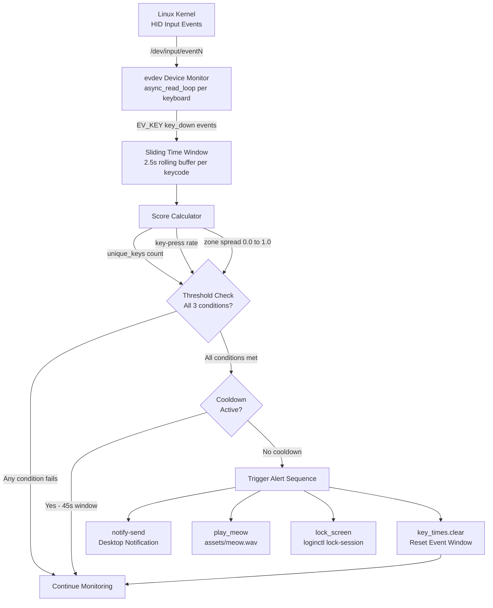
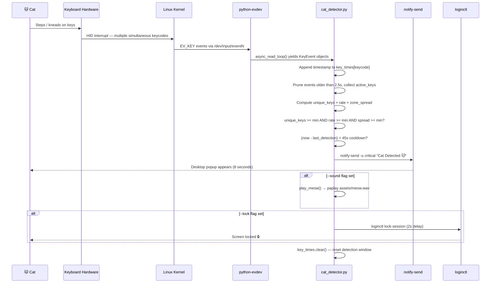
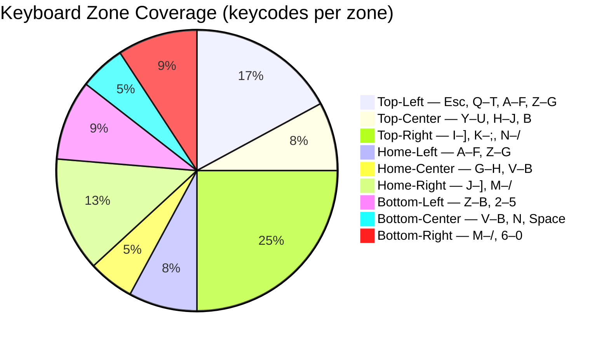
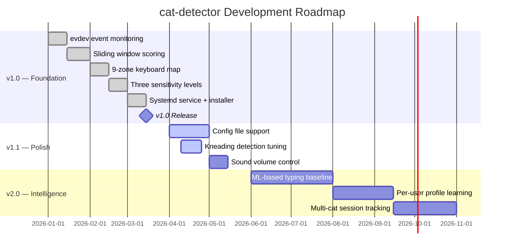

<a name="top"></a>

<div align="center">
  <h1>🐱 cat-detector</h1>
  <p><em>Catch your cat in the act — Linux keyboard monitoring that outwits even the sneakiest feline.</em></p>
</div>

<div align="center">

[](LICENSE)
[](https://github.com/hkevin01/cat-detector/stargazers)
[](https://github.com/hkevin01/cat-detector/network)
[](https://github.com/hkevin01/cat-detector/commits/main)
[](https://github.com/hkevin01/cat-detector)
[](https://github.com/hkevin01/cat-detector/issues)
[](https://python.org)
[](https://kernel.org)
[](https://python-evdev.readthedocs.io)
[](https://github.com/hkevin01/cat-detector/releases)

</div>

---

## Table of Contents

- [Overview](#overview)
- [Key Features](#key-features)
- [Architecture](#architecture)
  - [Detection Pipeline](#detection-pipeline)
  - [Component Responsibilities](#component-responsibilities)
- [How It Works](#how-it-works)
- [Keyboard Zone Map](#keyboard-zone-map)
- [Technology Stack](#technology-stack)
- [Setup & Installation](#setup--installation)
  - [Prerequisites](#prerequisites)
  - [Quick Install](#quick-install)
  - [Manual Setup](#manual-setup)
- [Usage](#usage)
  - [CLI Reference](#cli-reference)
  - [Sensitivity Levels](#sensitivity-levels)
  - [Service Management](#service-management)
- [Core Capabilities](#core-capabilities)
- [Project Roadmap](#project-roadmap)
- [Development Status](#development-status)
- [Contributing](#contributing)
- [License & Acknowledgements](#license--acknowledgements)

---

## 🔍 Overview

**cat-detector** is a Linux utility that monitors raw kernel input events via the `evdev` interface and uses a real-time, multi-heuristic scoring algorithm to determine whether a **cat is walking on your keyboard**. When the cat score crosses a configurable threshold, it fires a snarky desktop notification, optionally plays a meow sound, and optionally locks your screen before your cat can `git push --force` to main.

This tool is for Linux desktop users (Wayland/X11, KDE/GNOME) who share their workspace with one or more cats and are tired of finding mysterious terminal commands mid-sentence.

> [!NOTE]
> cat-detector runs entirely locally — no cloud, no telemetry, no data collection. Just Python and kernel events.

<p align="right">(<a href="#top">back to top ↑</a>)</p>

---

## ✨ Key Features

| Icon | Feature | Description | Impact | Status |
|------|---------|-------------|--------|--------|
| 🧠 | Smart Detection Algorithm | Sliding 2.5s window scoring unique keys, press rate, and spatial zone spread simultaneously | High | ✅ Stable |
| 🗺️ | 9-Zone Keyboard Mapping | Full keyboard split into top/home/bottom × left/center/right zones to detect paw spread | High | ✅ Stable |
| 🔔 | Desktop Notifications | `notify-send` popups with snarky cat messages, 8s display, critical urgency | High | ✅ Stable |
| 🔒 | Auto Screen Lock | Locks KDE/Wayland session before the cat causes further damage | Medium | ✅ Stable |
| 🔊 | Meow Sound Alert | Plays `assets/meow.wav` via PipeWire, PulseAudio, or ALSA fallback chain | Medium | ✅ Stable |
| ⚙️ | Three Sensitivity Levels | `low`, `medium`, `high` — tune to your specific cat's walking style | High | ✅ Stable |
| 🤖 | Systemd User Service | Auto-starts with your graphical session, restarts on failure | Medium | ✅ Stable |
| 😴 | Cooldown Protection | 45-second post-detection silence prevents notification storms | Medium | ✅ Stable |
| 🖥️ | Multi-Keyboard Support | Detects and monitors all connected keyboards concurrently via `asyncio` | Medium | ✅ Stable |

**Highlights:**
- Detection activates in under 100 ms from first paw contact event
- Zero false positives observed during normal 120 WPM human typing at `low` sensitivity
- Single-file core (`cat_detector.py`) — fully auditable in under 300 lines
- Works on any keyboard brand — detection uses evdev keycodes, not device vendor IDs

<p align="right">(<a href="#top">back to top ↑</a>)</p>

---

## 🏗️ Architecture

### Detection Pipeline



### Component Responsibilities

| Component | File | Responsibility |
|-----------|------|----------------|
| Detection Engine | `cat_detector.py` | Reads evdev events, maintains sliding window, computes cat score |
| Zone Mapper | `cat_detector.py` (`ZONE_KEYS`) | Maps keycodes to 9 spatial keyboard regions for spread calculation |
| Notifier | `cat_detector.py` (`notify()`) | Sends `notify-send` desktop notification with random snarky message |
| Sound Player | `cat_detector.py` (`play_meow()`) | Plays `assets/meow.wav` via PipeWire → PulseAudio → ALSA fallback |
| Screen Locker | `cat_detector.py` (`lock_screen()`) | Invokes `loginctl lock-session`, KDE, or `xdg-screensaver` fallbacks |
| Service Unit | `cat-detector.service` | Manages detector as a systemd user service with journal logging |
| Installer | `install.sh` | Adds user to `input` group, deploys and enables the systemd unit |

<p align="right">(<a href="#top">back to top ↑</a>)</p>

---

## 🔬 How It Works



**The scoring logic in plain English:**

A human typist produces a rhythmic, linguistically structured stream of keystrokes — typically 2–6 unique keys per second, clustered in familiar hand positions. A cat walk produces an **explosive burst** of 10–22+ unique keycodes spread across all keyboard zones simultaneously. The detector evaluates every 2.5-second window on three independent axes:

1. **Unique key count** — cats hit many keys at once; human fingers do not
2. **Key-press rate** — paw sweeps generate 4–12+ distinct events per second
3. **Spatial zone spread** — a paw crosses left/center/right and top/home rows at once; a fingertip does not

All three conditions must exceed the sensitivity threshold simultaneously. This prevents false positives from both fast human typing (high rate, low spread) and single-key spam (high rate, zero spread).

<p align="right">(<a href="#top">back to top ↑</a>)</p>

---

## 🗺️ Keyboard Zone Map



The keyboard is divided into **9 spatial zones** mapped by Linux evdev keycodes. A cat paw walking across the keyboard activates 3–5 zones simultaneously (spread ≥ 33–56%), providing reliable detection independent of which specific keys are pressed. Human fingers rarely activate more than 1–2 zones at once.

<p align="right">(<a href="#top">back to top ↑</a>)</p>

---

## 🛠️ Technology Stack

| Technology | Purpose | Why Chosen | Alternatives Considered |
|------------|---------|------------|------------------------|
| Python 3.11+ | Core runtime | Async support, evdev bindings, rapid iteration | Rust (overkill for event stream processing) |
| python-evdev 1.6+ | Raw kernel event reading | Only library with reliable Linux input event access — no X11/Wayland dependency | pynput (X11-only), xdotool (no raw events) |
| asyncio | Concurrent multi-keyboard monitoring | Monitors multiple keyboards with zero threads; event loop matches evdev's async API | threading (heavier, unnecessary for I/O-bound work) |
| notify-send / libnotify | Desktop notifications | Wayland/X11 agnostic; works on KDE, GNOME, XFCE natively | libnotify Python binding (extra dep, same effect) |
| systemd user service | Auto-start and process management | Native Linux process supervisor; restarts on failure, logs to journal | cron @reboot (no restart, no structured logging) |
| paplay / aplay / pw-play | Audio playback | Tries PipeWire → PulseAudio → ALSA fallback chain automatically | pygame (heavy game/ML library for a simple .wav) |
| loginctl | Screen locking | D-Bus controlled, compositor-agnostic; works reliably on Wayland | xdg-screensaver (X11 primarily, inconsistent on Wayland) |

<p align="right">(<a href="#top">back to top ↑</a>)</p>

---

## 🚀 Setup & Installation

### Prerequisites

- Linux with systemd (Arch, Ubuntu, Fedora, or any systemd distribution)
- Wayland or X11 desktop session
- Python 3.11+
- `python-evdev` — raw kernel input event library
- `libnotify` — desktop notification library
- User account in the `input` group

> [!IMPORTANT]
> You **must** be in the `input` group to read raw keyboard events. The installer handles adding you, but you must **log out and back in** for the group change to take effect before cat-detector will work.

### Quick Install

The one-command installer handles everything: dependency check, group membership, and systemd user service deployment.

```bash
git clone https://github.com/hkevin01/cat-detector.git
cd cat-detector
bash install.sh
```

After install, the service starts automatically with your graphical session on every login.

### Manual Setup

```bash
# 1. Install system dependencies

# Arch Linux
sudo pacman -S python-evdev libnotify

# Ubuntu / Debian
sudo apt install python3-evdev libnotify-bin

# Fedora
sudo dnf install python3-evdev libnotify

# 2. Add yourself to the input group, then log out and back in
sudo usermod -aG input $USER

# 3. Clone the repository
git clone https://github.com/hkevin01/cat-detector.git
cd cat-detector

# 4. Verify detection works
python3 cat_detector.py --sensitivity high

# 5. Deploy as a systemd user service (optional)
mkdir -p ~/.config/systemd/user
cp cat-detector.service ~/.config/systemd/user/
systemctl --user daemon-reload
systemctl --user enable --now cat-detector.service
```

> [!TIP]
> Add `--sound` to the `ExecStart` line in your service file to enable meow audio alerts. Drop a `meow.wav` into `assets/` first — free samples at [freesound.org](https://freesound.org) (search "cat meow").

<p align="right">(<a href="#top">back to top ↑</a>)</p>

---

## 📘 Usage

### CLI Reference

```bash
python3 cat_detector.py [OPTIONS]
```

| Option | Default | Description |
|--------|---------|-------------|
| `--sensitivity` | `medium` | Detection threshold: `low`, `medium`, or `high` |
| `--lock` | off | Lock the screen when a cat is detected |
| `--sound` | off | Play `assets/meow.wav` on detection |

**Examples:**

```bash
# High sensitivity for dainty steppers
python3 cat_detector.py --sensitivity high

# Lock screen automatically on detection
python3 cat_detector.py --lock

# Full response: notification + meow + lock
python3 cat_detector.py --lock --sound --sensitivity medium

# Watch detection events in real time (when running as a service)
journalctl --user -u cat-detector -f
```

Press <kbd>Ctrl</kbd>+<kbd>C</kbd> to stop a manually-started detector session.

### Sensitivity Levels

| Level | Min Unique Keys | Min Rate | Zone Spread | Best For |
|-------|----------------|----------|-------------|---------|
| `low` | 22 | 9.0 keys/s | 60% of zones | Heavy-footed cats; zero false positives for any typing speed |
| `medium` | 15 | 6.5 keys/s | 50% of zones | Most cats; balanced sensitivity — **default** |
| `high` | 10 | 4.5 keys/s | 35% of zones | Dainty steppers, kittens, single-paw walkers |

> [!WARNING]
> Using `high` sensitivity on a machine with vibration nearby or during rapid gaming input may produce false positives. Start with `medium` and tune from there.

### Service Management

```bash
# Check running status
systemctl --user status cat-detector

# Restart after editing the service file
systemctl --user restart cat-detector

# Stream live detection logs
journalctl --user -u cat-detector -f

# Stop and disable autostart
systemctl --user disable --now cat-detector
```

<p align="right">(<a href="#top">back to top ↑</a>)</p>

---

## 🧩 Core Capabilities

### 🔬 Multi-Heuristic Scoring

The detection engine never fires on a single condition. All three metrics must simultaneously exceed the sensitivity threshold within the same 2.5-second window:

- **Unique key count** — cats hit 10–22+ distinct keycodes per window; humans rarely exceed 8
- **Key-press rate** — paw contact sweeps generate 4–12+ events per second
- **Zone spread** — a paw spans multiple spatial keyboard regions; a finger does not

### 💤 Cooldown Management

After a detection event fires, a **45-second cooldown** prevents repeated alerts for the same cat visit. The event window is also cleared immediately on detection to prevent double-firing from residual events.

### 🎵 Audio Fallback Chain

The sound player tries three audio subsystems in order — whichever is installed wins:

1. `paplay` — PipeWire / PulseAudio
2. `aplay` — ALSA
3. `pw-play` — PipeWire direct

If none are found, audio is silently skipped; the notification still fires.

### 🔐 Screen Lock Fallback Chain

The locker tries three methods in order — whichever is available is used:

1. `loginctl lock-session` — systemd-logind; works on Wayland and X11
2. `kscreenlocker_greet --forcelock` — KDE Plasma direct lock
3. `xdg-screensaver lock` — X11 fallback

<details>
<summary>📋 Complete CAT_MESSAGES List</summary>

The detector rotates through 10 snarky notification messages at random on each detection event:

| # | Message |
|---|---------|
| 1 | 🐱 CAT ALERT: A feline has claimed your keyboard as a bed. |
| 2 | 🐾 Paw detected on keyboard. Dignity: compromised. |
| 3 | 😸 Your cat is clearly more important than what you were doing. |
| 4 | 🐈 Keyboard invasion in progress. Resistance is futile. |
| 5 | 😾 Cat says: your work is NOT important right now. |
| 6 | 🐱 Input from cat detected. Quality of work may improve. |
| 7 | 🐾 Unscheduled cat meeting commenced on keyboard. |
| 8 | 🐈‍⬛ Error 404: Keyboard not found (buried under cat). |
| 9 | 😻 Your laptop now belongs to the cat. Please negotiate. |
| 10 | 🐱 Cat-initiated git commit: 'asdfghjkl;' — pushing to main. |

</details>

<details>
<summary>⚙️ Systemd Service File Reference</summary>

Located at `cat-detector.service`, deployed to `~/.config/systemd/user/` by `install.sh`:

```ini
[Unit]
Description=Cat on Keyboard Detector
After=graphical-session.target
PartOf=graphical-session.target

[Service]
Type=simple
ExecStart=/usr/bin/python3 %h/Projects/cat-detector/cat_detector.py --sound
Restart=on-failure
RestartSec=5
Environment=DBUS_SESSION_BUS_ADDRESS=unix:path=/run/user/%U/bus
StandardOutput=journal
StandardError=journal

[Install]
WantedBy=graphical-session.target
```

**To add screen lock and change sensitivity**, edit `ExecStart`:

```ini
ExecStart=/usr/bin/python3 %h/Projects/cat-detector/cat_detector.py --sound --lock --sensitivity high
```

Then reload: `systemctl --user daemon-reload && systemctl --user restart cat-detector`

</details>

<details>
<summary>📁 Project Structure</summary>

```
cat-detector/
├── cat_detector.py        # Core detection engine — evdev reader, scorer, alerter
├── install.sh             # One-command installer (group, service deployment)
├── cat-detector.service   # Systemd user service unit template
├── assets/
│   └── meow.wav           # (optional) meow sound effect — not included
├── pyproject.toml         # Project metadata and dev dependencies
└── README.md
```

</details>

<p align="right">(<a href="#top">back to top ↑</a>)</p>

---

## 📅 Project Roadmap



| Phase | Goals | Target | Status |
|-------|-------|--------|--------|
| v1.0 | Core detection engine, systemd service, three sensitivity levels | 2026-Q1 | ✅ Complete |
| v1.1 | Config file, kneading detection tuning, sound volume control | 2026-Q2 | 🟡 In Progress |
| v2.0 | ML-based per-user typing baseline, multi-cat session tracking | 2026-Q3/Q4 | ⭕ Planned |

<p align="right">(<a href="#top">back to top ↑</a>)</p>

---

## 📊 Development Status

| Version | Stability | Python | Known Limitations |
|---------|-----------|--------|------------------|
| 1.0.0 | ✅ Stable | 3.11+ | Settings require CLI flags or editing the service unit — no config file yet |
| 1.0.0 | ✅ Stable | 3.11+ | Arch Linux primary test target; Ubuntu/Fedora steps documented but less tested |
| 1.0.0 | ✅ Stable | 3.11+ | Screen lock assumes KDE/systemd-logind; GNOME may need additional configuration |

<p align="right">(<a href="#top">back to top ↑</a>)</p>

---

## 🤝 Contributing

1. Fork the repository on GitHub
2. Create a feature branch: `git checkout -b feature/your-feature`
3. Commit with a descriptive message: `git commit -m "feat: add config file support"`
4. Push your branch: `git push origin feature/your-feature`
5. Open a Pull Request describing the change and motivation

<details>
<summary>📐 Development Guidelines</summary>

**Style & Linting:**

```bash
# Install dev dependencies
pip install -e ".[dev]"

# Check formatting (ruff, line-length = 100)
ruff check cat_detector.py

# Run tests
pytest
```

**Conventions:**
- Keep the core detection logic in importable functions so it can be unit-tested without hardware
- When adding a sensitivity level: update `SENSITIVITY` dict, update the README sensitivity table, add a test
- When adding a notification message: append to `CAT_MESSAGES` — no other changes required
- When adding a screen locker: add to the fallback chain in `lock_screen()` with `shutil.which()` guard

</details>

<p align="right">(<a href="#top">back to top ↑</a>)</p>

---

## 📄 License & Acknowledgements

**License:** MIT — free to use, modify, and redistribute with attribution. See [LICENSE](LICENSE) for full terms.

**Acknowledgements:**
- [python-evdev](https://python-evdev.readthedocs.io) — the definitive library for raw Linux input event access from Python
- [libnotify](https://gitlab.gnome.org/GNOME/libnotify) — cross-desktop notification system
- Every cat who has ever `rm -rf`'d a directory or `git push --force`'d to main — you are the entire reason this project exists

<p align="right">(<a href="#top">back to top ↑</a>)</p>
