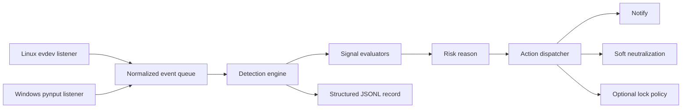
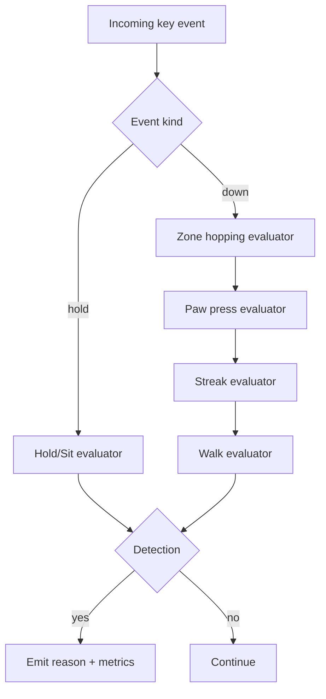
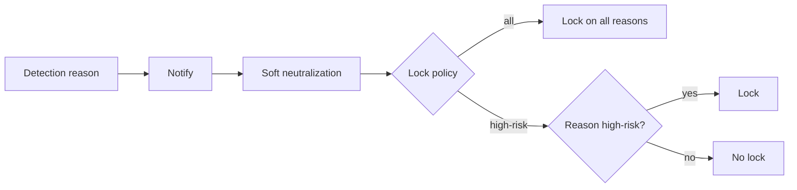
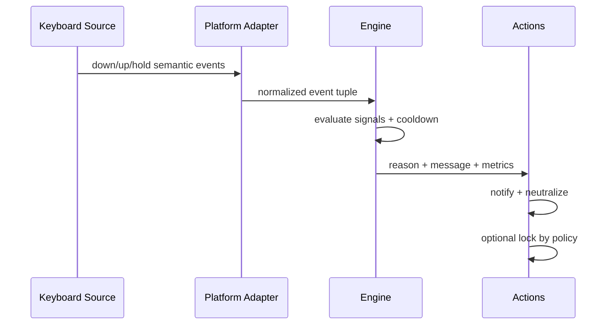
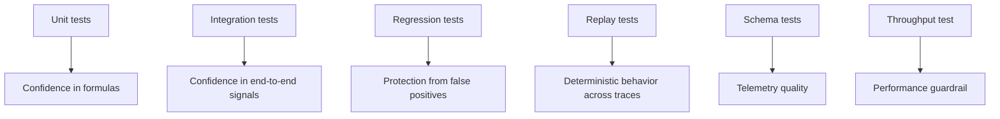

# cat-detector

cat-detector is a cross-platform keyboard anomaly detector designed to protect workstations from accidental keyboard damage patterns caused by cat paws and toddler palm-slams. The project is intentionally safety-first: it detects and mitigates without blocking normal keyboard input paths, and it keeps response logic explicit and testable. The system combines deterministic heuristics, conservative adaptation, and platform abstraction so the same detection logic behaves consistently on Linux and Windows.

> [!IMPORTANT]
> Input grabbing and freeze-style controls are intentionally removed. The mitigation path is designed to be smooth and reversible: notify, neutralize active input state, then optionally lock according to policy.

## Quick Decision Guide

This section is meant to answer the practical question first: which detection signal does what, and when should you trust it as a lock-worthy event versus a soft-mitigation event.

| Signal | What It Detects | Best For | Usually Not Triggered By | Typical Risk Level | Recommended Response |
|---|---|---|---|---|---|
| Walking/Burst | Broad random key spread at high rate | Cat movement across multiple rows/zones | Focused human text entry | Medium | Soft mitigation, optional lock by policy |
| Zone Hopping | Rapid jumps across non-adjacent keyboard zones | Paw gait with spatial leaps | Adjacent finger alternation | Medium | Soft mitigation, optional lock by policy |
| Paw Press | Multiple simultaneous non-modifier keys | Paw landings and palm mashes | Sequential typing | Medium to High | Soft mitigation; lock optional |
| Enter+Simultaneous | Enter plus simultaneous char keys | High-impact accidental action risk | Intentional human usage is rare | High | Auto-lock in high-risk profile |
| Hold/Sit | Repeated autorepeat flood on one or more keys | Cat sitting/standing on keys | Standard typing cadence | High | Auto-lock in high-risk profile |
| Key Streak | Same key repeated rapidly in a short window | Single-key paw tapping | Normal text composition | Low to Medium | Soft mitigation by default |

| Profile | Lock Behavior | Why Use It | When Not To Use |
|---|---|---|---|
| all | Locks on any detection reason when lock enabled | Highest containment and simple policy | May feel too aggressive in busy typing environments |
| high-risk | Locks only on sitting/standing and enter+simultaneous | Reduces disruption while preserving protection from highest-impact events | If you need strict lock on every detection |

## How The System Works

cat-detector is architected as a deterministic event pipeline. Platform-specific listeners normalize raw keyboard events into a shared queue, then a platform-agnostic engine evaluates independent signal detectors. This structure is important because it decouples OS-specific input semantics from detection formulas, making tuning and regression testing much more reliable.

| Layer | Responsibility | Why It Exists |
|---|---|---|
| Platform Adapters | Convert OS events to normalized down/up/hold stream | Keeps core logic OS-agnostic and testable |
| Event Queue | Buffers event flow into a single consumer model | Avoids race-heavy direct coupling between listeners and detector |
| Detection Engine | Applies all signal formulas and policy checks | Centralizes safety logic in one deterministic runtime path |
| Action Dispatcher | Executes response side effects | Keeps mitigation and lock behavior composable and auditable |
| Telemetry Writer | Persists JSONL detection records | Enables replay analysis and threshold tuning over real events |

## Detection Algorithms And Formula Choices

The project intentionally uses interpretable formulas rather than opaque black-box classifiers in the runtime path. The reason is operational safety: when a lock decision is made, operators should be able to explain exactly why it fired.

### 1) Walk Confidence

Walk confidence is a weighted normalized score:

$$
	ext{score} = 0.45\cdot\frac{U}{U_{min}} + 0.35\cdot\frac{R}{R_{min}} + 0.20\cdot\frac{S}{S_{min}}
$$

Where:

- $U$ is unique keys in the sliding window
- $R$ is event rate (events/second)
- $S$ is zone spread

This weighted form was chosen over a hard single-threshold count because it better balances shape and intensity of activity. Pure rate thresholds alone can overreact to fast typists, while pure spread thresholds can miss rapid compact bursts. The blended score captures both breadth and velocity.

### 2) Zone Hopping

Zone-hopping computes transitions across compressed zone sequence and counts far hops using Manhattan distance on a 3x3 keyboard zone grid. A far hop is any transition with distance $\ge 2$.

$$
d_{Manhattan} = |r_1-r_2| + |c_1-c_2|
$$

This approach was selected instead of Euclidean distance because grid-step movement on keyboard zones is naturally discrete and Manhattan distance is simpler and more stable for integer cells.

### 3) Hold/Sit And Enter Risk Signals

Hold/sit detection uses autorepeat density in a lookback window. Enter+simultaneous is treated as a high-risk semantic pattern because it carries disproportionate action risk in many foreground applications.

| Algorithm | Core Inputs | Formula/Rule | Why This Choice | Alternative Considered |
|---|---|---|---|---|
| Walk/Burst | unique keys, rate, spread | Weighted normalized score plus hard gates | Explainable and robust against single-feature spikes | Single scalar event-rate threshold |
| Zone Hopping | recent zone sequence | transitions + far-hops + unique-zones constraints | Captures paw gait geometry | N-gram key modeling with higher complexity |
| Paw Press | current held key set | simultaneous non-modifier count threshold | Reliable for paw landings | Chord rarity model |
| Hold/Sit | per-key repeat queues | multi-key or single-key repeat flood | Targets highest-impact stuck-key behavior | Duration-only long-press detector |
| Streak | same-key recent taps | count within short window | Fast and interpretable | Language-model token likelihood |

## Risk-Aware Mitigation Model

Detection and response are intentionally separated. A detection reason is first generated by algorithmic logic, then policy determines whether to lock or only neutralize. This keeps formulas stable while allowing operational policy to evolve safely.

| Detection Reason | High-Risk Classification | Behavior In high-risk Profile | Behavior In all Profile |
|---|---|---|---|
| sitting/standing | Yes | Lock | Lock |
| enter+simultaneous | Yes | Lock | Lock |
| walking | No | Soft mitigation only | Lock |
| zone hopping | No | Soft mitigation only | Lock |
| paw press | No | Soft mitigation only | Lock |
| key streak | No | Soft mitigation only | Lock |

> [!NOTE]
> Soft neutralization is best-effort and intentionally lightweight. It does not grab devices or freeze input. The goal is to cancel active modifier states and common accidental UI switch contexts without introducing lockout risk.

## Platform Behavior

| Platform | Input Backend | Hold Signal Source | Soft Neutralization Method | Lock Capability |
|---|---|---|---|---|
| Linux | evdev | native key_hold events | best-effort modifier release + Escape via desktop tooling | loginctl / desktop locker fallback chain |
| Windows | pynput | synthesized timer repeat while key held | best-effort key-up + Escape via user32 | LockWorkStation |

## Telemetry And Replay

Structured event records are persisted as JSONL so detection behavior can be audited and tuned over time. This is important because workstation behavior differs across users, applications, and typing styles. Replay fixtures provide deterministic edge-case checks that keep improvements from regressing older protections.

| Field | Type | Example | Why It Matters |
|---|---|---|---|
| timestamp_utc | ISO timestamp | 2026-07-09T12:34:56.123456+00:00 | ordering and cross-system correlation |
| entity | string | cat, toddler | mode-aware analysis |
| reason | string | walking, sitting/standing | policy decision traceability |
| sensitivity | string | low, medium, high | threshold context |
| toddler_mode | bool | false | behavior segmentation |
| metrics | object | keys/rate/spread/etc | root-cause introspection |
| walk_score | number or null | 1.08 | confidence diagnostics |
| walk_threshold | number or null | 1.03 | adaptation and decision boundary tracking |

| Replay Asset | Purpose | Outcome Guarded |
|---|---|---|
| human_typing_edge trace | Stress realistic fast typing | no false positive under edge rhythm |
| cat_walk_burst trace | Representative cat burst | at least one detection |

## Validation Strategy

The project treats reliability as a first-class engineering feature. Multiple test families verify formulas, side effects, regression boundaries, and cross-platform abstractions.

| Test Family | What It Verifies | Why It Is Needed |
|---|---|---|
| Unit constants/formulas | Thresholds and metric math | Detect silent formula drift |
| Integration detection | Multi-signal triggering behavior | Ensure realistic cat patterns fire |
| False-positive regression | Human-like typing patterns | Keep practical day-to-day usability |
| Trace replay | Deterministic edge traces | Preserve known-good behavior under replay |
| Schema validation | JSONL payload structure | Prevent telemetry corruption |
| Platform abstraction | Linux/Windows mapping assumptions | Keep behavior consistent across adapters |
| Throughput guard | Hot-path cost envelope | Avoid accidental performance regressions |

## API Reference (Collapsible)

Core Engine API

| Symbol | Role | Notes |
|---|---|---|
| _detection_engine | Main signal evaluation loop | Shared by Linux and Windows backends |
| compute_walk_metrics | Pure metric extraction | Returns active keys and WalkMetrics |
| walk_confidence | Weighted normalized score | Interpretable confidence scalar |
| zone_hop_detection_signal | Spatial gait detector | Uses transitions, far hops, unique zones |
| hold_detection_signal | Hold/sit evaluator | Excludes human-hold key list |
| paw_detection_signal | Simultaneous key cluster evaluator | Includes enter+simultaneous rule |
| streak_detection_signal | Same-key burst evaluator | Windowed count with mode-specific params |

Response And Policy API

| Symbol | Role | Notes |
|---|---|---|
| dispatch_detection_actions | Side-effect orchestration | notify -> neutralize -> optional sound -> policy lock |
| neutralize_active_input | Smooth mitigation stage | best-effort, non-grabbing response |
| should_lock_for_reason | Reason-aware lock decision | supports all and high-risk profiles |
| lock_profile | Policy resolver | reads args override or environment fallback |

Telemetry API

| Symbol | Role | Notes |
|---|---|---|
| DetectionRecord | Structured event model | Contains reason, metrics, thresholds, metadata |
| validate_detection_record_payload | Schema guard | strict field and type checks |
| record_detection_event | JSONL append writer | resilient best-effort persistence |
| AdaptiveBaselineCalibrator | Conservative threshold adaptation | raises walk threshold only |

## Tech Stack

cat-detector intentionally stays lightweight and Python-native. The stack prioritizes deterministic behavior and cross-platform operability over framework complexity.

| Component | Technology | Why This Choice |
|---|---|---|
| Runtime language | Python | Rapid iteration with clear algorithmic code |
| Linux input backend | evdev | Direct and reliable event semantics |
| Windows input backend | pynput + user32 | Broad compatibility with controlled abstraction |
| Testing | pytest | Strong ecosystem for unit/integration/replay patterns |
| Linting | ruff | Fast, strict static quality gate |
| Packaging | pyproject + spec/iss assets | Native path for Linux and Windows distribution |

> [!TIP]
> Treat thresholds and formulas as product logic, not magic constants. Every threshold should be justified by a known user risk or an observed replay profile.

## Why Deterministic Heuristics Instead Of End-To-End ML

The current production path uses deterministic heuristics because it must provide predictable, debuggable behavior on safety-sensitive interactions. A black-box model can be added as an advisory score in the future, but replacing the primary lock path with opaque inference too early can reduce operator trust and incident diagnosability.

| Approach | Strength | Weakness | Fit For Current Stage |
|---|---|---|---|
| Deterministic heuristics | Explainable, stable, low-latency | Requires manual threshold maintenance | Excellent |
| Pure supervised ML | Potentially high recall | Needs curated labeled data and drift controls | Premature as sole gate |
| Hybrid (heuristics + ML score) | Better adaptability with guardrails | Higher implementation complexity | Good future direction |

> [!WARNING]
> If future ML scoring is introduced, keep deterministic high-risk guards as hard safety rails until calibration quality is proven across broad replay datasets.

## Related Research And References

The project design is informed by literature in keystroke dynamics, behavioral biometrics, and anomaly detection. These references are useful for future roadmap work such as profile adaptation, user-conditioned thresholds, and hybrid anomaly scoring.

### Peer-reviewed and survey references

- Monrose, F., Rubin, A. D. Keystroke dynamics as a biometric for authentication. Future Generation Computer Systems (2000).
- Killourhy, K. S., Maxion, R. A. Comparing anomaly-detection algorithms for keystroke dynamics. DSN (2009).
- Banerjee, S., Woodard, D. L. Biometric authentication and identification using keystroke dynamics: A survey. Journal of Pattern Recognition Research (2012).
- Teh, P. S., Teoh, A. B. J., Yue, S. A survey of keystroke dynamics biometrics. The Scientific World Journal (2013).

### ArXiv references relevant to anomaly modeling

- Chalapathy, R., Chawla, S. Deep Learning for Anomaly Detection: A Survey. arXiv:1901.03407.
- Ruff, L. et al. Deep One-Class Classification. arXiv:1802.06360.
- Xu, H. et al. Unsupervised Anomaly Detection via Variational Auto-Encoder for Seasonal KPIs in Web Applications. arXiv:1802.03903.

> [!CAUTION]
> These ML references are roadmap context, not a statement that the current runtime detector uses deep models today.

## Practical Notes

The middle ground between under-reaction and over-reaction is policy. The detector should be strict on high-impact signatures such as sustained hold floods and enter-linked simultaneous presses, while keeping lower-risk movement signatures in soft-mitigation mode unless stricter policy is explicitly selected.

This principle keeps user experience smoother during normal usage, reduces unnecessary lock events, and still responds aggressively when the probability of harmful input is highest.

## Project Pointers

- Core detector implementation: [cat_detector.py](cat_detector.py)
- Service unit: [cat-detector.service](cat-detector.service)
- Test suite overview: [tests/README.md](tests/README.md)
- Replay tests: [tests/test_trace_replay.py](tests/test_trace_replay.py)
- Integration tests: [tests/test_integration_detection.py](tests/test_integration_detection.py)
- Regression tests: [tests/test_regression_false_positives.py](tests/test_regression_false_positives.py)

## Changelog

See [CHANGELOG.md](CHANGELOG.md) for versioned history and rationale.
